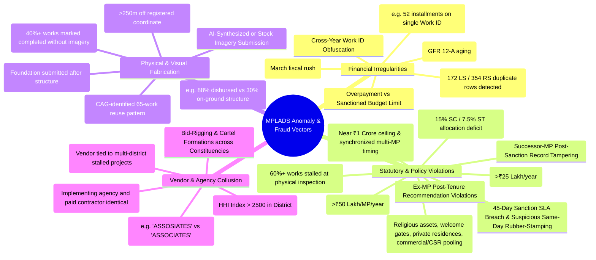
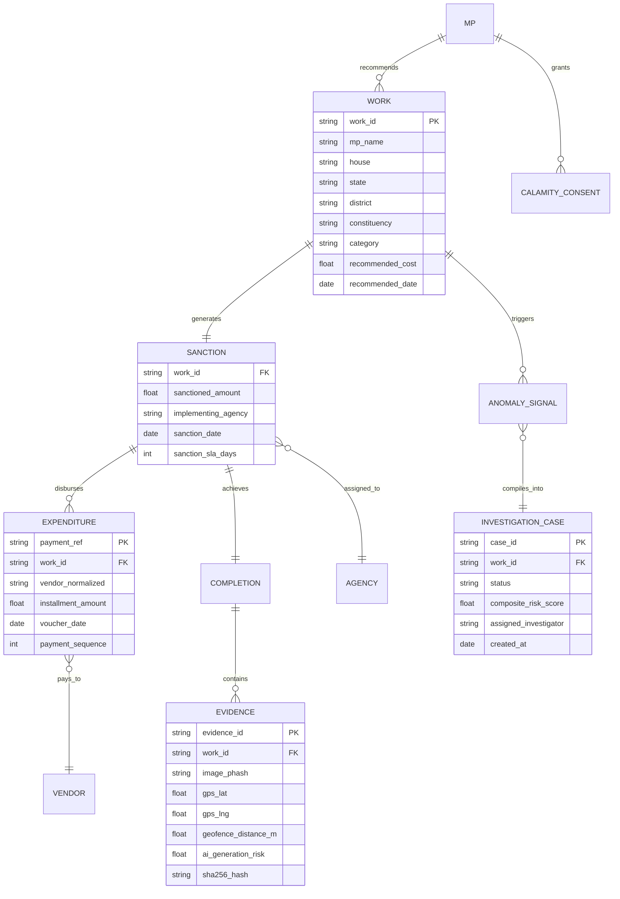
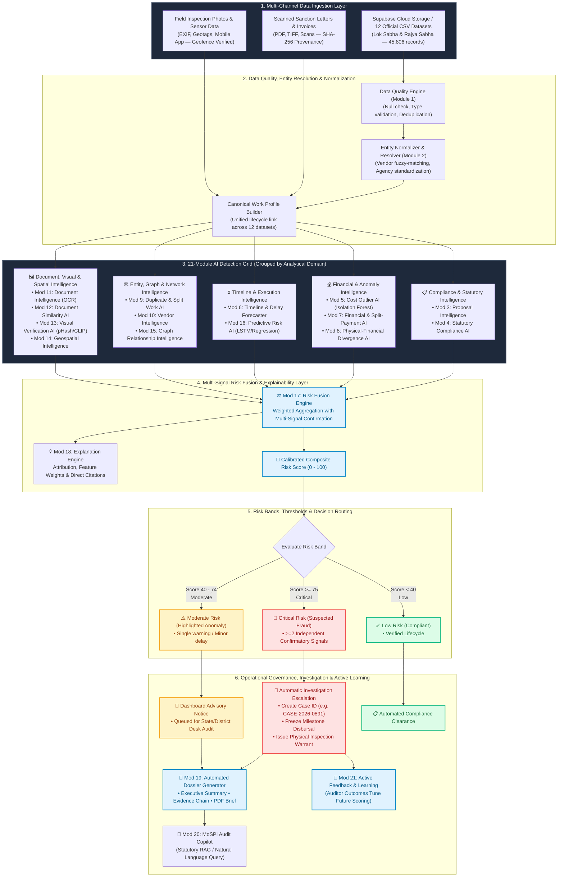
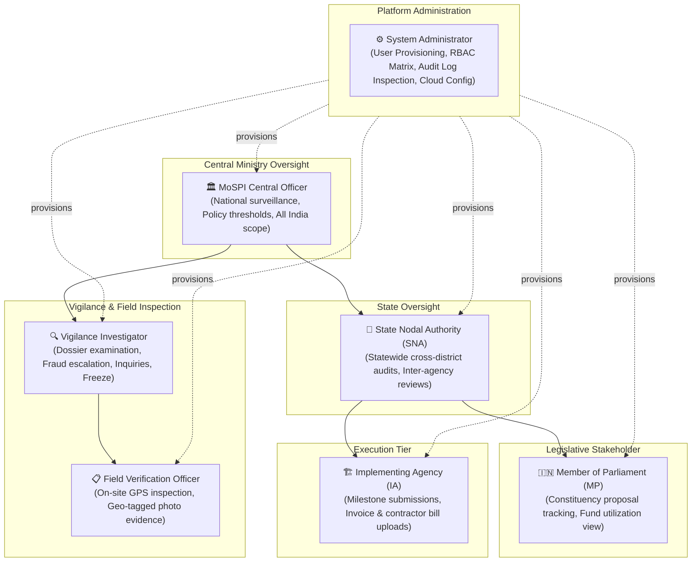
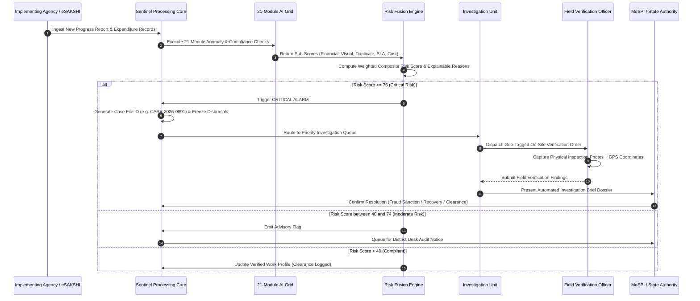

# MPLADS Sentinel: Master System Architecture, AI Detection Specification & Operational Flow

> **Statutory Alignment**: Ministry of Statistics and Programme Implementation (MoSPI) — Data Informatics & Innovation Division (DIID)  
> **Problem Statement**: SIH26102 — Development of an AI-Powered Multi-Source Surveillance, Risk-Intelligence, and Vigilance Governance Layer for the MPLAD Scheme  
> **Core Operating Philosophy**: *e-SAKSHI records what happened; MPLADS Sentinel verifies whether what happened makes sense, connects evidence across datasets, explains why a case is risky, and prioritizes investigation queues.*

---

## 1. Executive Problem Statement & Scope Definition

The **Member of Parliament Local Area Development Scheme (MPLADS)** facilitates development projects recommended by Hon'ble Members of Parliament across India. While the existing **e-SAKSHI** portal serves as the administrative transaction and workflow recording layer, the absence of an automated cross-dataset intelligence and automated verification engine creates vulnerability to systemic irregularities:

```text
┌────────────────────────────────────────────────────────────────────────────────────────┐
│                                 CORE SYSTEM OBJECTIVE                                  │
│ 1. What is unusual?                ──► Multi-Signal Anomaly & Pattern Detection        │
│ 2. Why is it unusual?              ──► Evidence-Backed, Transparent Explanations       │
│ 3. How serious is it?              ──► Calibrated Composite Risk Scoring (0 to 100)   │
│ 4. What should be audited first?   ──► Risk-Ranked Investigation Prioritization Queue │
└────────────────────────────────────────────────────────────────────────────────────────┘
```

### 1.1. Three-Tier Governance Control Model
```text
  PREVENTION (Tier 1)         DETECTION (Tier 2)          INVESTIGATION (Tier 3)
  ├── RBAC & Separation       ├── 21-Module AI Engine     ├── Prioritized Case Queues
  ├── Statutory Budget Locks  ├── Cross-Dataset Joins     ├── Explainable AI Briefs
  ├── Pre-Sanction Checking   ├── Computer Vision & Graph ├── Automated Audit Dossiers
  └── Milestone Dependencies  └── Risk Fusion Matrix      └── Field Inspection Orders
```

### 1.2. e-SAKSHI Integration Model & Native Cloud Core
MPLADS Sentinel does **not** replace the existing e-SAKSHI portal; instead, it operates as an **autonomous risk-intelligence, evidence verification, and vigilance surveillance layer** atop it. Sentinel ingests and analyzes data already generated across the project lifecycle:

1. **Native Dataset Core (45,806 Cleaned Records Across 12 Cloud CSVs)**:
   - Hosted directly on **Supabase Cloud Storage** (`datasets` public bucket) and streamed on-demand via public CDN with in-memory LRU caching, removing local disk storage dependencies.
   - Covers 100% of tabular financial records, recommendation logs, administrative sanctions, completion status strings, vendor expenditures, and calamity consents from Lok Sabha & Rajya Sabha.
   - Powers all deterministic compliance checks, statistical cost anomalies, installment structuring detectors, duplicate work NLP, vendor concentration graph models, and SLA breach engines.
2. **e-SAKSHI Document & Evidence Ingestion Hub (`/app/data`)**:
   - Allows authorized stakeholders to upload active lifecycle documents (PDF Sanction Orders, Contractor RA Bills, Geotagged Site Inspection Photographs, Completion Certificates).
   - Automatically parses, extracts, and runs the multi-modal detection grid against national and peer-district baselines.
3. **External Statutory Registries (Connectors)**:
   - Connectors to GSTN (active status), MCA21 (Director master data / shell firm identification), PFMS (treasury clearance logs), and Bhoomi / CIMS (land title & cadastral records).

### 1.3. Zero-Fake-Data Enforcement & Scoped Surveillance Lifecycle
To ensure audit defensibility in vigilance proceedings, Sentinel enforces a strict **Zero-Fake-Data Policy**:
- **Baseline Unloaded State (`mode: "unloaded"`)**: Prior to active dataset ingestion or user file uploads, the surveillance surface rests at a clean mathematical zero baseline (`0 works monitored`, `₹0 Cr sanctioned`, `₹0 Cr disbursed`, `0 risk flags`). All hardcoded mock numbers and synthetic fallback records have been removed.
- **Dynamic Ingestion State (`mode: "uploaded"`)**: Ingested datasets dynamically generate real-time canonical work ledgers, financial expenditure aggregates, state and district performance indices, and geocoded risk anomaly points.
- **Administrative Scope Reset**: System Administrators can restore the surveillance scope to baseline or switch active evaluation batches via `/api/datasets/scope/restore`, ensuring reproducible audit environments.

---

## 2. Exhaustive Fraud Taxonomy & Anomaly Signatures

Based on historical Comptroller and Auditor General (CAG) audit findings and empirical analysis of official Lok Sabha and Rajya Sabha datasets (45,806+ historical records), Sentinel implements machine-checkable anomaly detectors across operational tiers:



### 2.1. Exhaustive Anomaly Signatures & Detection Methodology Matrix

$$\begin{array}{|l|l|c|l|}
\hline
\textbf{Category} & \textbf{Anomaly Signature} & \textbf{Data Requirement} & \textbf{Detection Methodology} \\ \hline
\text{Financial} & \text{Split Payments / Multi-Installment Structuring} & \text{Expenditure CSV} & \text{Frequency \& IQR Installment Clustering (e.g. 52 installments)} \\ \hline
\text{Financial} & \text{Exact Duplicate Ledger Transactions} & \text{Expenditure CSV} & \text{Composite Key Exact Match Hash (172 LS / 354 RS rows)} \\ \hline
\text{Financial} & \text{Multi-Dimensional Velocity Outlier} & \text{Spend + Sanction} & \text{scikit-learn Isolation Forest (100 Trees, 7-dim Z-Scores)} \\ \hline
\text{Financial} & \text{Disbursement Exceeding Sanctioned Allocation} & \text{Sanction + Spend} & \text{Cross-Dataset Arithmetic Balance Check} \\ \hline
\text{Financial} & \text{Year-End Fund Dumping (March Spikes)} & \text{Expenditure CSV} & \text{Temporal Outlier Histogram (\% spend in Q4 vs Q1-Q3)} \\ \hline
\text{Financial} & \text{Cross-Year Work ID Obfuscation} & \text{Spend + Sanctions} & \text{Multi-FY Temporal Sequence Graph} \\ \hline
\text{Policy} & \text{Non-Permissible Banned Works Funded} & \text{Works Recommended} & \text{all-MiniLM-L6-v2 Semantic Search + Prohibited Lexicon} \\ \hline
\text{Policy} & \text{Multilingual / Indic Scope Duplication} & \text{Works Recommended} & \text{SBERT Cross-Lingual Embeddings + Regional Lexicon (\ge 0.50)} \\ \hline
\text{Policy} & \text{45-Day Sanction SLA Violation} & \text{Recom + Sanction} & \text{Date Delta Validation Matrix (Flag if } \Delta t > 45\text{ days)} \\ \hline
\text{Policy} & \text{0-Day Rubber-Stamping Sanction} & \text{Recom + Sanction} & \text{Zero-day sanction timestamp detection without vetting} \\ \hline
\text{Policy} & \text{1-Year Completion SLA Violation} & \text{Sanction + Complete} & \text{Chronological State Machine (Flag if } \Delta t > 365\text{ days)} \\ \hline
\text{Policy} & \text{Outside-Constituency Cap Breach (>₹25L/yr)} & \text{Allocated Limits} & \text{Spatial Aggregation per MP Financial Year} \\ \hline
\text{Policy} & \text{Repair/Renovation Spend Cap (>₹50L/yr)} & \text{Works Sanctioned} & \text{Category Expenditure Summation per MP Year} \\ \hline
\text{Policy} & \text{Mandatory SC/ST Allocation Quota Deficit} & \text{Works Sanctioned} & \text{Constituency Demographics Sum (<15\% SC or <7.5\% ST)} \\ \hline
\text{Policy} & \text{Ex-MP Post-Tenure Recommendation} & \text{Recom + MP Master} & \text{Tenure Window Date Boundary Validation} \\ \hline
\text{Policy} & \text{Successor-MP Record Tampering} & \text{Sanction + Spend} & \text{Post-Sanction MP Key Invariance Checker} \\ \hline
\text{Policy} & \text{Calamity Fund Clustering \& Orchestrated Timing} & \text{Calamity Consent} & \text{Clustering around ₹1 Cr limit + Narrow time window} \\ \hline
\text{Policy} & \text{UC Non-Filing \& Aging (GFR 12-A)} & \text{Expenditure CSV} & \text{Unspent Balance Aging Analysis (>12 months post-spend)} \\ \hline
\text{Vendor} & \text{Fuzzy Shell Vendor Name Fragmentation} & \text{Expenditure CSV} & \text{Levenshtein + Jaro-Winkler Distance (Threshold } \ge 0.88\text{)} \\ \hline
\text{Vendor} & \text{IDA / Contractor Self-Dealing Conflict} & \text{Expenditure CSV} & \text{Graph Centrality \& Entity Matching (IDA == Vendor)} \\ \hline
\text{Vendor} & \text{Bid-Rigging Syndicates \& Cartel Rings} & \text{Expenditure CSV} & \text{NetworkX Louvain Modularity Community Clustering} \\ \hline
\text{Vendor} & \text{Vendor \& Agency Monopoly Concentration} & \text{Expenditure CSV} & \text{Herfindahl-Hirschman Index (HHI > 2500 in District)} \\ \hline
\text{Visual} & \text{Missing Image on Completed Works} & \text{Works Completed} & \text{Null / Placeholder String Flagging (~40\% missing)} \\ \hline
\text{Visual} & \text{Reused Image Across Constituencies} & \text{Evidence Store} & \text{64-bit dHash Difference Hashing (Hamming } \le 6\text{ bits / \ge 90\%)} \\ \hline
\text{Visual} & \text{Zero-Shot Asset Category Mismatch} & \text{Evidence Store} & \text{CLIP (ViT-B/32) Cross-Modal Zero-Shot Matching} \\ \hline
\text{Geospatial} & \text{EXIF Geofence Violation (>250m)} & \text{GPS + Photo EXIF} & \text{Haversine Great-Circle Distance Metric} \\ \hline
\text{Document} & \text{Digital Alteration & Spliced Layers} & \text{PDF / Scans} & \text{Error Level Analysis (ELA) Compression Artifact Spikes} \\ \hline
\hline
\end{array}$$

---

## 3. Data Foundation & Canonical Entity Architecture

Sentinel ingests, normalizes, and streams 12 primary datasets across **Lok Sabha** and **Rajya Sabha** directly from Supabase Cloud Storage:
1. `Works Recommended (LS & RS)`: Proposal description, MP ID, estimated cost, recommendation date.
2. `Works Sanctioned (LS & RS)`: Work ID, sanctioned amount, sanction date, implementing agency (IDA).
3. `Works Completed (LS & RS)`: Completion date, final cost, inspection status, image proof references.
4. `Expenditure on Completed & Ongoing Works (LS & RS)`: Payment reference, vendor details, installment amounts, voucher dates.
5. `Allocated Limit for Hon'ble MPs (LS & RS)`: Constituency quota, sanctioned balance, release history.
6. `Calamity Consent Records (LS & RS)`: Emergency calamity relief consents, contributing MP, state allocation.



### 3.1. Entity Resolution & Canonical Work Profile
To reconcile incomplete records without exact Work ID matches across disaggregated departments, Sentinel executes a hierarchical entity resolution pipeline:

```text
MATCHING PIPELINE:
Exact Keys (Work ID, Voucher No, Payment Reference)
  └──► Secondary Keys (MP + District + Amount + Date Window ±15 Days)
         └──► Semantic Keys (Description all-MiniLM Embedding Cosine Similarity > 0.88)
                └──► Emits: match_confidence (0.0 to 1.0), match_method, matched_fields
```

---

## 4. End-to-End System Architecture



---

### 4.1. Master 21-Module AI Engine Specification Table

$$\begin{array}{|c|l|l|l|l|c|}
\hline
\textbf{\#} & \textbf{AI Module} & \textbf{Input Data} & \textbf{Core Technique} & \textbf{Primary Output} & \textbf{Scope} \\ \hline
1 & \text{Data Quality AI} & \text{Cloud CSVs / Schemas} & \text{Pydantic / Type checks / Hash sets} & \text{Data Quality Score \& Bad-row Flags} & \text{Core} \\ \hline
2 & \text{Entity Resolution AI} & \text{Work IDs, Names, Dates} & \text{Levenshtein + Date delta + Embeddings} & \text{Canonical Work Profile \& Link Graph} & \text{Core} \\ \hline
3 & \text{Proposal Intelligence} & \text{Work Description, Estimates} & \text{all-MiniLM-L6-v2 + Robust Median} & \text{Pre-Sanction Price \& Scope Risk} & \text{Core} \\ \hline
4 & \text{Statutory Compliance AI} & \text{Category, MP Limits, Dates} & \text{Deterministic Rules + Regex Lexicons} & \text{Guideline Violation Flags \& Citations} & \text{Core} \\ \hline
5 & \text{Cost Anomaly AI} & \text{Sanction, Spend, Unit rates} & \text{Isolation Forest (100 Trees) + Z-Scores} & \text{Multi-Dimensional Velocity Outlier Score} & \text{Core} \\ \hline
6 & \text{Timeline Intelligence} & \text{Recom, Sanction, Comp dates} & \text{State Machine + Historical SLA distributions} & \text{SLA Breach Score \& Stalled Status Flag} & \text{Core} \\ \hline
7 & \text{Financial Intelligence} & \text{Expenditure vouchers, Amounts} & \text{IQR Spikes, Z-score, Benford's Law} & \text{Split Payment \& Exact Duplicate Alert} & \text{Core} \\ \hline
8 & \text{Physical-Financial Divergence} & \text{PFMS spend vs Progress \%} & \text{Ratio gap arithmetic (\delta = \%spend - \%phys)} & \text{Disbursement Advance Risk Score} & \text{Core} \\ \hline
9 & \text{Duplicate / Split Work AI} & \text{Descriptions, Costs, Locations} & \text{all-MiniLM-L6-v2 + Indic Lexicon + Fuzz} & \text{Cross-Lingual Scope Duplication (\ge 50\%)} & \text{Core} \\ \hline
10 & \text{Vendor Intelligence} & \text{Vendor names, Work values} & \text{Fuzzy string clustering + HHI concentration} & \text{Shell Vendor \& Monopoly Index Flag} & \text{Core} \\ \hline
11 & \text{Document Intelligence (OCR)} & \text{PDF Sanctions, Bills (Vault)} & \text{PaddleOCR + Bounding Box Layout match} & \text{Sanction-vs-Bill Inconsistency Flag} & \text{Core} \\ \hline
12 & \text{Document Forensics (ELA)} & \text{Scanned Certificates & Bills} & \text{Error Level Analysis (JPEG Artifact Spikes)} & \text{Digital Alteration & Splicing Flag} & \text{Core} \\ \hline
13 & \text{Visual Verification AI} & \text{Site Photographs (Vault)} & \text{64-bit dHash + CLIP (ViT-B/32 Zero-Shot)} & \text{Reused Photo \& Asset Mismatch Alert} & \text{Core} \\ \hline
14 & \text{Geospatial Intelligence} & \text{GPS coordinates, Geofences} & \text{Haversine Distance + Spatial Clustering} & \text{Geofence Breach (>250m) Flag} & \text{Core} \\ \hline
15 & \text{Graph Intelligence} & \text{MP-Agency-Vendor Network} & \text{NetworkX Louvain Modularity + HHI} & \text{Bid-Rigging Syndicates & Cartel Rings} & \text{Core} \\ \hline
16 & \text{Predictive Risk AI} & \text{Historical milestone velocities} & \text{Ridge Regression / Survival Analysis} & \text{Probability of Chronic Delay (>80\%)} & \text{Core} \\ \hline
17 & \text{Risk Fusion Engine} & \text{All module sub-scores (S_i)} & \text{Weighted Multi-Signal Confirmation Matrix} & \text{Composite Risk Score (0-100) \& Band} & \text{Core} \\ \hline
18 & \text{Explanation Engine} & \text{Triggered rules, Source rows} & \text{Attribution trees + Formatted Citations} & \text{Plain English Evidence Summary} & \text{Core} \\ \hline
19 & \text{Investigation Dossier Gen.} & \text{Work Twin, Audit logs, Hash} & \text{Dynamic PDF Template + SHA-256 Stamp} & \text{Auditor-Ready Investigation Brief} & \text{Core} \\ \hline
20 & \text{MoSPI Audit Copilot} & \text{Natural Language auditor query} & \text{Statutory RAG (all-MiniLM-L6-v2) + Gemini} & \text{Cited Legal Answers \& Grounded SQL} & \text{Core} \\ \hline
21 & \text{Active Feedback & Learning} & \text{Auditor disposition outcomes} & \text{Bayesian Weight Updating / Supervised tune} & \text{Recalibrated Thresholds \& Drift Metrics} & \text{Core} \\ \hline
\end{array}$$

### 4.2. Persistent Reports Database Architecture (`reportsDatabaseService.js` / `reports_db.json`)
To ensure complete provenance and historical traceability, all evaluated audit batches and work dossiers are committed to a durable persistence layer:
- **Durable File-Backed Store (`backend/data/reports_db.json`)**: Employs an in-memory cache synchronized with atomic disk writes, guaranteeing that generated audit briefs, forensic evidence cards, and state metrics survive server restarts and network interruptions.
- **Dossier Batch Schema**:
  ```typescript
  interface AuditReportBatch {
    batchId: string;                     // e.g., "BATCH-2026-00412"
    timestamp: string;                   // ISO 8601 creation timestamp
    datasetsUploaded: string[];          // List of correlated lifecycle streams
    completenessScore: number;           // 0 to 100% data stream availability
    activeDimensions: string[];          // AI detection modules activated
    workReports: CanonicalWorkReport[];  // Itemized works with composite scores & statutory citations
    flaggedCases: CanonicalWorkReport[];  // Filtered Critical & High risk cases
    analytics: {
      totalWorksMonitored: number;
      totalSanctionedCr: number;
      totalExpenditureCr: number;
      riskCounts: { critical: number; high: number; medium: number; low: number };
      stateMetrics: StateRiskMetric[];
      geoPoints: GeocodedRiskPoint[];
    };
  }
  ```
- **REST Endpoints & Navigation**:
  - `GET /api/datasets/reports`: Returns catalog of all historical audit batches.
  - `GET /api/datasets/reports/:batchId`: Retrieves specific audit batch and itemized works.
  - `POST /api/datasets/scope/restore`: Clears active upload scope back to clean unloaded baseline.
  - Frontend accessible at `/app/reports` (Uploaded Reports Hub).

### 4.3. System Administrator 1-Click Multi-Stream Batch Ingestion (`POST /api/datasets/admin/ingest-all`)
To facilitate rapid audit onboarding, the platform exposes an automated batch ingestion pipeline:
- **Correlated Streams**: Concurrently ingests and joins all 12 statutory datasets across Lok Sabha and Rajya Sabha (Recommendations, Sanctions, Completions, Expenditures, Installments, Calamity Consents).
- **Entity Consolidation**: Maps heterogeneous ledger schemas into unified `CanonicalWorkProfile` instances, resolves contractor aliases via Levenshtein clustering, and verifies timeline milestones.
- **Trigger Execution**: Executes the 21-module AI grid in one operation and automatically commits the resulting surveillance state to the persistent reports database.

### 4.4. Real-Time Operational Telemetry Subsystem (`GET /api/system/activity`)
To ensure continuous audit operational readiness, Sentinel provides live telemetry via a dedicated heartbeat monitor:
- **Database Health**: Real-time connection status (`Connected` / `Online`), total active records, and database engine type (Supabase PostgreSQL / Persistent JSON Store).
- **Backend Service**: Server port (`5000`), active process uptime, and request throughput.
- **AI Engine Readiness**: Operational module count (`21/21 Ready`), assurance tier (`Statutory Grade`), and inference model registry.
- **Persistent UI Widget**: Rendered in the bottom-left sidebar footer across all dashboard views.

### 4.5. National Geospatial Project Risk Map & WGS84 Geodetic Projection Engine
To accurately pinpoint geographic anomaly concentrations across India without relying on external proprietary tile servers, Sentinel implements a calibrated geodetic projection engine atop the official Indian state-boundaries cartographic standard:
- **Cartographic Asset**: Clean vector-rendered raster base (`/maps/india-states.png`, 624×468 px, 4:3 aspect ratio) reflecting official Survey of India political boundaries.
- **WGS84 Geodetic Normalization Formulation**:
  Maps geographical coordinates $(\text{Lat}, \text{Lon})$ directly to pixel percentages $(x_{\text{pct}}, y_{\text{pct}})$ within the container:
  $$\begin{aligned}
  x_{\text{px}} &= 116 + \left(\frac{\text{Lon} - 68.11}{97.40 - 68.11}\right) \times (507 - 116) \\
  y_{\text{px}} &= 24 + \left(\frac{37.10 - \text{Lat}}{37.10 - 8.08}\right) \times (425 - 24) \\
  x_{\text{pct}} &= \frac{x_{\text{px}}}{624} \times 100\% \\
  y_{\text{pct}} &= \frac{y_{\text{px}}}{468} \times 100\%
  \end{aligned}$$
- **Interactive Geospatial UX Features**:
  - **Dynamic Radar Pins**: Color-coded pins with pulsing radar ripples (`animate-ping` for Critical risk, `animate-pulse` for High risk).
  - **Micro-Tooltips**: Instant hover details displaying project title, district, state, risk score, and sanctioned cost.
  - **Selected Anomaly Inspector**: Interactive right drawer showing work metadata, statutory violation citations, and 1-click navigation to the Digital Project Twin (`/app/projects/:id`).
  - **Multi-Level Filters**: State/UT scope dropdown and risk severity filters (`Critical`, `High`, `Normal`).
  - **Zero-Fake-Data Overlay**: Displays a clean "Geospatial Surveillance Standing By" banner when un-ingested.

---

## 5. Mathematical Formulation of Multi-Signal Risk Fusion

To prevent false alarms from distorting audit priorities, Sentinel enforces a **multi-signal confirmation rule**: a project cannot enter the `Critical / High Risk` category from a single weak anomaly; it requires at least **two independent confirmatory risk signals**.

### 5.1. Risk Weighting Matrix

$$\text{Composite Risk Score} = \min\left(100, \; \sum_{i=1}^{8} \left( S_i \times W_i \times C_i \right) + \Delta_{\text{multiplier}}\right)$$

$$\begin{array}{|c|l|c|l|}
\hline
i & \textbf{Risk Dimension} & \textbf{Weight } (W_i) & \textbf{Primary Evaluation Triggers (Mapped AI Modules)} \\ \hline
1 & \text{Financial \& Split Payments} (S_{\text{fin}}) & 0.25 & \text{Installment spikes, overpayment, round-tripping (Mod 7, 8)} \\ \hline
2 & \text{Physical–Financial Divergence} (S_{\text{div}}) & 0.20 & \text{Financial progress } \gg \text{ reported physical progress (Mod 8, 16)} \\ \hline
3 & \text{Visual Evidence Integrity} (S_{\text{vis}}) & 0.15 & \text{Missing photo, reused image pHash, Geofence breach (Mod 13, 14)} \\ \hline
4 & \text{Duplicate \& Ghost Works} (S_{\text{dup}}) & 0.15 & \text{High semantic + geographic spatial overlap (Mod 3, 9)} \\ \hline
5 & \text{Vendor \& Monopoly Risk} (S_{\text{vend}}) & 0.10 & \text{Fuzzy shell fragmentation, IDA self-dealing, HHI (Mod 10, 15)} \\ \hline
6 & \text{Statutory \& Policy Compliance} (S_{\text{comp}}) & 0.05 & \text{Banned categories, outside-constituency caps, SC/ST (Mod 4)} \\ \hline
7 & \text{Timeline \& SLA Slippage} (S_{\text{time}}) & 0.05 & \text{45-day sanction breach, 1-year stalled state (Mod 6, 16)} \\ \hline
8 & \text{Document Authenticity} (S_{\text{doc}}) & 0.05 & \text{Altered sanction metadata, OCR text mismatch (Mod 11, 12)} \\ \hline
\hline
\end{array}$$

Where:
- $S_i \in [0, 100]$: Normalized risk score from detection module domain $i$.
- $C_i \in [0.5, 1.0]$: Model confidence index based on input data completeness.
- $\Delta_{\text{multiplier}} = +15$: Injected when $\ge 2$ signals exceed the severe anomaly threshold ($S_i \ge 80$).

### 5.2. Physical–Financial Divergence Metric
$$\text{Divergence Gap } (\delta) = \left( \frac{\text{Cumulative Expenditure}}{\text{Sanctioned Budget}} \right) - \text{Physical Progress Rung}$$
- If $\delta > +0.35$ (e.g. 88% disbursed vs 30% verified physical completion) $\implies S_{\text{div}} = \min(100, \; \delta \times 160)$.

---

## 6. Complete 7-Role Institutional Governance & RBAC Hierarchy

Access adheres strictly to the institutional governance principle: `Role + Jurisdiction + Assignment + Permission`.

> [!IMPORTANT]
> **Zero Public Self-Registration**: Self-registration is permanently disabled. Institutional accounts, jurisdiction assignments, and role transitions are governed and provisioned exclusively by the **Platform System Administrator** via the dedicated System Administration Console.



### 6.1. Comprehensive 7-Role Institutional RBAC Permissions Matrix

$$\begin{array}{|l|c|c|c|c|c|c|c|}
\hline
\textbf{Functional Permission} & \textbf{MoSPI} & \textbf{State Nodal} & \textbf{MP} & \textbf{Impl. Agency} & \textbf{Investigator} & \textbf{Field Officer} & \textbf{System Admin} \\ \hline
\text{User \& Access Management} & \times & \times & \times & \times & \times & \times & \checkmark \\ \hline
\text{View National Analytics} & \checkmark & \times & \times & \times & \checkmark & \times & \checkmark \\ \hline
\text{View State/District Scope} & \checkmark & \checkmark & \text{Own Const.} & \text{Assigned} & \checkmark & \text{Assigned} & \checkmark \\ \hline
\text{Recommend Works} & \times & \times & \checkmark & \times & \times & \times & \times \\ \hline
\text{Submit Financial Claims (RA Bills)} & \times & \times & \times & \checkmark & \times & \times & \times \\ \hline
\text{Upload Image/Doc Evidence}& \checkmark & \checkmark & \times & \checkmark & \checkmark & \checkmark & \checkmark \\ \hline
\text{Initiate Investigation} & \checkmark & \checkmark & \times & \times & \checkmark & \times & \checkmark \\ \hline
\text{Freeze Project Disbursal} & \checkmark & \checkmark & \times & \times & \checkmark & \times & \times \\ \hline
\text{Submit Field Inspection / GPS} & \times & \times & \times & \times & \times & \checkmark & \times \\ \hline
\text{Export Statutory Dossier (PDF)} & \checkmark & \checkmark & \checkmark & \times & \checkmark & \times & \checkmark \\ \hline
\text{Query AI Audit Copilot} & \checkmark & \checkmark & \checkmark & \times & \checkmark & \times & \checkmark \\ \hline
\text{Inspect System Audit Logs} & \checkmark & \times & \times & \times & \checkmark & \times & \checkmark \\ \hline
\hline
\end{array}$$

### 6.2. Data Security, Immutability & Anti-Tampering Rules
1. **Immutable Historical Records**: No user role (including System Admins) can delete or overwrite historical financial vouchers, uploaded evidence hashes, or AI score snapshots. Any correction generates a new version with a cryptographic SHA-256 audit entry.
2. **Separation of Duties**: An MP cannot approve their own recommended works or close investigations on their constituency. Implementing agencies cannot modify sanctioned budgets.
3. **Public Layer Boundary**: Citizen access is restricted to verified completion statistics to prevent premature publication of unconfirmed vigilance investigation queues.

---

## 7. Operational Sequence: Anomaly Detection to Case Closure



### 7.1. Formal Case Lifecycle State Machine

```text
┌─────────────┐       Score >= 75       ┌───────────┐      Assigned to Officer     ┌──────────────┐
│  TRIGGERED  ├────────────────────────►│  TRIAGED  ├─────────────────────────────►│ UNDER_REVIEW │
└─────────────┘                         └─────┬─────┘                              └──────┬───────┘
                                              │                                           │
                                              │ Desk Audit Clarification                  │ Order Site Visit
                                              ▼                                           ▼
                                        ┌───────────┐                         ┌───────────────────────┐
                                        │ ADVISORY  │                         │ FIELD_INSPECT_ORDERED │
                                        └───────────┘                         └───────────┬───────────┘
                                                                                          │
                                                                                          │ Inspection Uploaded
                                                                                          ▼
┌─────────────┐      Official Sanction Order     ┌────────────────────┐       ┌───────────────────────┐
│   CLOSED    │◄─────────────────────────────────┤ ACTION_RECOMMENDED │◄──────┤   EVIDENCE_ATTACHED   │
│  RESOLVED   │   (Fund Freeze / Recovery)       └────────────────────┘       └───────────────────────┘
└─────────────┘
```

### 7.2. Strict Institutional Role-Based Access Control (RBAC) & Jurisdictional Scoping Matrix

To uphold statutory confidentiality and prevent conflict-of-interest tampering, Sentinel enforces strict jurisdictional scoping and data visibility rules across all 7 institutional personas:

| Persona / Role | Jurisdictional Scope | Data Visibility & Permissions | Prohibited Actions / Blind Spots |
|---|---|---|---|
| **1. MoSPI Central Officer** (`mospi_central_officer`) | **All-India (National)** — 543 Lok Sabha & 250 Rajya Sabha constituencies. | Full read/write access to all 45,806 projects, nationwide anomaly heatmaps, master scheme datasets, statutory threshold configs, and executive policy reports. | Cannot bypass audit logging of manual parameter recalibrations. |
| **2. State Nodal Authority** (`state_nodal_authority`) | **State-Level** (e.g. Rajasthan, Delhi, Maharashtra). | Filtered view of works, expenditure vouchers, and district queues within their designated State. Can authorize state-level compliance clearances. | Cannot inspect or query projects or investigations belonging to other States. |
| **3. District Authority / DM** (`district_authority`) | **District-Level** (e.g. New Delhi, Varanasi, Jaipur). | Monitors district sanction workflows, SLA breach counters, and milestone progress. Authorizes local administrative sanctions. | Cannot alter state/national risk threshold weights. |
| **4. Hon'ble Member of Parliament** (`mp`) | **Constituency Scope** (e.g. New Delhi PC-04). | Recommends new works, tracks execution velocity, monitors unspent quota balance, views citizen grievance status. | **Strictly Prohibited**: Cannot view confidential internal vigilance inquiry dossiers (`/app/investigations`) or auditor memos on their own works. |
| **5. Implementing Agency (IDA)** (`implementing_agency`) | **Agency Scope** (e.g. DSIIDC, CPWD, PWD). | Uploads contractor invoices, Running Account (RA) bills, and Measurement Book (MB) records for works assigned to their agency. | **Strictly Prohibited**: Cannot view internal vigilance inquiry dossiers, collusion detection subgraphs, or case escalations targeting their own agency. |
| **6. Field Verification Officer** (`field_verification_officer`) | **Assigned District / Site Warrants**. | Uploads geotagged mobile photos, verifies GPS coordinates within 250m geofence, and signs off on physical milestone percentages. | Only sees image evidence tasks and on-site inspection orders. |
| **7. Vigilance Investigator / Auditor** (`investigator`) | **Cross-District Investigation Queues**. | Accesses flagged cases (Risk Score $\ge 50$), full forensic evidence chains, subpoena audit briefs, and legal dossiers. | Read-only enforcement on original e-SAKSHI source rows (cannot mutate ledger records). |

---

## 8. Role-Organized Evidence Intake & Cryptographic Vault Standard

Evidence is ingested into 4 dedicated institutional streams with automated SHA-256 fingerprinting:

```text
EVIDENCE INGESTION STREAMS:
├── 📂 Invoices & Contractor Bills      ──► Implementing Agency (RA Bills, GFR 12-A, Claimed INR)
├── 📂 Site Inspection Photographs      ──► Field Verification Officer (Geotagged JPG/PNG, GPS lat/lng)
├── 📂 Vigilance & Forensic Reports     ──► Vigilance Investigator (Inquiry Memos, Forensic Dossiers)
└── 📂 Sanctions & Regulatory Gazettes  ──► MoSPI / State Nodal Authority (Sanctions, Approvals)
```

### 8.1. Structured Evidence Card Standard
Every flagged project generates a standardized machine-and-human readable Evidence Card:

```json
{
  "work_id": "MPL-004821",
  "project_title": "Construction of Community Hall at Village Khera",
  "mp_name": "Hon'ble Demo MP",
  "district": "New Delhi PC-04",
  "sanctioned_amount_inr": 3500000.0,
  "disbursed_amount_inr": 3080000.0,
  "physical_progress_verified_pct": 52.0,
  "composite_risk_score": 88.4,
  "risk_band": "CRITICAL",
  "triggering_signals": [
    {
      "signal_code": "FIN_DIV_01",
      "dimension": "Physical-Financial Divergence",
      "severity": "HIGH",
      "confidence": 0.94,
      "finding": "Disbursed 88.0% (₹30.8L) while verified physical progress is 52.0% (Gap: 36.0%)",
      "citation": "MPLADS Guidelines 2023 §3.4 — Milestone-linked release breach"
    },
    {
      "signal_code": "VEND_SPLIT_03",
      "dimension": "Vendor Concentration & Structuring",
      "severity": "CRITICAL",
      "confidence": 0.98,
      "finding": "119 installment payments routed to single contractor near ₹19,990 structuring ceiling",
      "citation": "GFR 2017 Rule 157 — Splitting of tenders and payment structuring prohibited"
    }
  ],
  "actionable_inspection_checklist": [
    "Verify plinth and roofing completion at registered GPS coordinates",
    "Audit contractor material invoices against approved schedule of rates",
    "Cross-check physical measurement book (MB) entries with voucher dates"
  ],
  "dossier_sha256_hash": "e3b0c44298fc1c149afbf4c8996fb92427ae41e4649b934ca495991b7852b855"
}
```

### 8.2. Automated Investigation Dossier Generator (Module 19)
The engine compiles a tamper-evident audit brief containing:
1. **Executive Summary**: Work ID, MP details, sanctioned amount, total disbursed, implementing agency, and jurisdiction.
2. **Explainable AI Breakdown**: Primary signals that triggered escalation, module confidence scores, and comparative district benchmarks.
3. **Multi-Source Evidence Chain**: Side-by-side view of contractor invoices vs. sanctioned itemized bill of quantities, timestamped image comparisons, and GPS distance deviations.
4. **Statutory Export Engine**: One-click downloadable PDF dossier with SHA-256 verification hash for MoSPI and vigilance committee proceedings.

### 8.3. Grounded AI Audit Copilot (Module 20)
Natural-language interface grounded exclusively in structured project records and statutory rulebooks (MPLADS Guidelines 2023, GFR 2017 Rule 130/157/238):
- *“Show all projects in this district assigned to the same vendor with >₹25 Lakh budget.”*
- *“Compare the unit cost of this community hall against the state median for 2025–26.”*
- *“Which projects have a physical-financial divergence gap exceeding 30% in Rajasthan?”*

---

## 9. Concrete Technology Stack & Deployment Topologies

```text
┌─────────────────────────────────────────────────────────────────────────────┐
│                           FRONTEND USER INTERFACE                           │
│  Next.js 16 (App Router) • React 19 (Pure JS/JSX) • Tailwind CSS v4         │
│  Lucide React Icons • Recharts • High-Contrast MoSPI Government Theme       │
└──────────────────────────────────────┬──────────────────────────────────────┘
                                       │ HTTPS / REST / JSON
┌──────────────────────────────────────▼──────────────────────────────────────┐
│                           BACKEND APPLICATION API                           │
│  Node.js / Express REST API (Auth, RBAC middleware, Cloud Loader, Case Flow)│
└───────────────────┬─────────────────────────────────────┬───────────────────┘
                    │                                     │
┌───────────────────▼──────────────────────┐   ┌──────────▼───────────────────┐
│     SUPABASE DATABASE & STORAGE          │   │    PYTHON FASTAPI AI ENGINE  │
│  Supabase PostgreSQL (Tables, Views, RLS)│   │  scikit-learn (IsoForest,LOF)│
│  Supabase Storage (datasets bucket CDN)  │   │  sentence-transformers       │
│  Cryptographic SHA-256 Evidence Vault    │   │  PaddleOCR • NetworkX Graph  │
└──────────────────────────────────────────┘   └──────────────────────────────┘
```

| Layer | Technologies & Frameworks | Key Responsibilities |
|---|---|---|
| **Frontend** | Next.js 16 (App Router), React 19 (Pure JSX), Tailwind CSS v4, Recharts, Lucide React | 7 Institutional Command Centers, Project Digital Twins, Role Ingestion Hub (`/app/data`), Uploaded Reports (`/app/reports`), Live System Telemetry Card |
| **API Backend** | Node.js, Express REST API, Multer, JWT, Morgan, Winston | Strict 7-role RBAC enforcement, Cloud dataset streaming, Case lifecycle state machine, System Activity monitor, Admin batch ingest |
| **Persistent Reports DB** | Node.js FS atomic engine (`reports_db.json`) & Supabase sync | Durable persistence for all evaluated batches, itemized work dossiers, and active surveillance scope across server restarts |
| **GIS & Geospatial** | WGS84 Geodetic Normalization Engine, India State-Boundaries Raster (`/maps/india-states.png`) | Pan-India risk anomaly pinning, calibrated geographic projection, state/UT drill-down, and proximity clustering |
| **Cloud Datasets** | Supabase Cloud Storage (`datasets` bucket, CDN streaming) | 12 official CSV datasets (45,806 records across Lok Sabha & Rajya Sabha), In-memory LRU caching |
| **Database & Auth** | Supabase PostgreSQL, Row Level Security (RLS) | Relational storage for projects, evidence chains, and audit logs |
| **AI Microservices** | Python 3.14, FastAPI, Pydantic, Uvicorn | 21 AI modules, multi-modal surveillance grid, sub-second inference |
| **NLP & Vectors** | `sentence-transformers` (`all-MiniLM-L6-v2` + Indic Lexicon Mapping) | 384-dimensional dense embeddings, multilingual & Indic duplicate work detection, statutory RAG retrieval |
| **Tabular ML** | `scikit-learn` (IsolationForest 100 Trees, LOF) | Unsupervised multi-dimensional spending velocity outlier detection, physical-financial divergence z-scores |
| **Vision Forensics** | 64-bit Perceptual `dHash` + `CLIP` Zero-Shot (ViT-B/32) | Cross-constituency image deduplication, zero-shot asset category verification, luminescence consistency |
| **Document Forensics** | Error Level Analysis (ELA) + JPEG Compression Gradients | Tamper detection, digitally altered figures, and spliced stamps on contractor running bills |
| **Graph Intelligence** | `NetworkX` Louvain Modularity Community Detection + HHI | Bid-rigging syndicates, contractor cartel rings, and vendor monopoly concentration index |
| **AI Copilot** | Statutory Vector RAG (`all-MiniLM-L6-v2`) + Google Gemini 2.0 Flash | Grounded natural language queries citing MoSPI 2023 Guidelines and GFR 2017 Rules |

---

*Master System Architecture Document for MPLADS Sentinel — Ministry of Statistics and Programme Implementation (MoSPI).*
