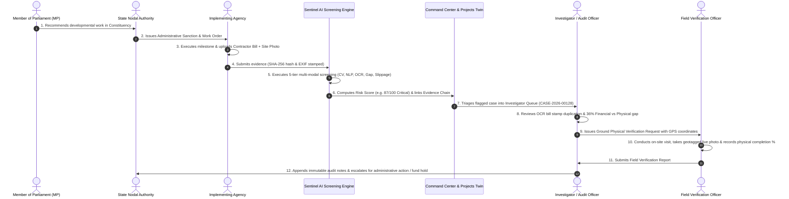

# MPLADS Sentinel (रक्षक) — Institutional Operational Flow & System Architecture

> **Multi-Source AI Surveillance, Predictive Risk Scoring, and Evidence-Linked Integrity Platform for MPLADS**  
> **Beneficiary Ministry:** Ministry of Statistics and Programme Implementation (MoSPI), Government of India  
> **Problem Statement:** SIH26102 (Smart India Hackathon)  
> **Production Deployment:**
> - **Frontend Web App (Vercel):** [https://mplads-sentinel-omega.vercel.app/](https://mplads-sentinel-omega.vercel.app/)
> - **Backend REST API (Render):** [https://mplads-sentinel-1.onrender.com/api](https://mplads-sentinel-1.onrender.com/api)
> - **Database & Auth:** Supabase PostgreSQL with Row Level Security (RLS) + JWT

---

## 1. 🎯 Executive Platform Mission & Architecture

While the official **eSAKSHI** portal records administrative workflow events (MP proposals, administrative sanctions, contractor bills, and completion certificates), **MPLADS Sentinel** continuously audits **whether what is recorded is internally consistent, physically true on the ground, and compliant with statutory guidelines**.

```
┌────────────────────────────────────────────────────────────────────────┐
│                    eSAKSHI & PFMS TRANSACTION LAYER                    │
│           (MP Recommendations • Sanction Orders • Disbursements)       │
└───────────────────────────────────┬────────────────────────────────────┘
                                    │ Automated Continuous Ingestion
┌───────────────────────────────────▼────────────────────────────────────┐
│                    MPLADS SENTINEL AI SCREENING ENGINE                 │
│                                                                        │
│  1. Financial-Physical Gap Engine     2. Perceptual CV Image Hasher    │
│  3. SBERT Duplicate NLP Matcher       4. Layout & OCR Bounding Studio  │
│  5. Cost Outlier & Rate Deviation     6. Predictive Timeline Forecaster│
└───────────────────────────────────┬────────────────────────────────────┘
                                    │ Composite Grounded Risk Score (0–100)
┌───────────────────────────────────▼────────────────────────────────────┐
│                     ROLE-BASED STAKEHOLDER PORTAL                      │
│        (Command Center • Digital Twin • Investigation Workspace)       │
└────────────────────────────────────────────────────────────────────────┘
```

---

## 2. 👥 Role-Based Access Control (RBAC) & Stakeholder Personas

MPLADS Sentinel strictly adheres to **Role + Jurisdiction + Assignment + Permission** (Least Privilege & Separation of Duties).

### The 6 Core Operational User Types

| # | User Type | Operational Focus | Scope / Jurisdiction | Synthetic Demo Persona |
|---|---|---|---|---|
| 1 | **MoSPI / Ministry Officer** | National monitoring, system oversight, risk thresholds, cross-state comparisons, AI Copilot | National (All India) | **Dr. Ananya Sharma** (`ministry@mpladssentinel.demo`) |
| 2 | **State Nodal Authority** | State-level monitoring, district performance audits, nodal inquiries | State Scope (e.g. Rajasthan) | **Rajiv Mehta** (`state@mpladssentinel.demo`) |
| 3 | **Member of Parliament (MP)** | Recommended works tracking, milestone & expenditure status, constituency feedback | Parliamentary Constituency (e.g. New Delhi PC-04) | **Hon'ble Demo MP** (`mp@mpladssentinel.demo`) |
| 4 | **Implementing Agency** | Work execution, milestone updates, invoice & cryptographic photo proof uploads | Assigned Projects / Circle | **Er. Rajesh K. Sinha** (`agency@mpladssentinel.demo`) |
| 5 | **Investigator / Audit Officer** | Flagged project review, linear evidence chain audit, document & photo comparison | Assigned Cases / Zone | **Priya Verma** (`investigator@mpladssentinel.demo`) |
| 6 | **Field Verification Officer** | Physical on-site inspection, GPS & timestamp geotagging, site photo verification | Assigned District / Unit | **Amit Singh** (`field@mpladssentinel.demo`) |

> **Key Rule:** Citizen/Public Auditor is excluded from this operational version. No single user can alter historical transactions, delete evidence, or artificially modify AI risk scores.

---

## 3. 🔄 End-to-End Operational Lifecycle Workflow



---

## 4. 🧠 The 5 Multi-Modal AI Detection Engines

### 4.1 Financial vs Physical Execution Divergence
- **The Problem:** Implementing agencies claiming 80%+ financial disbursement while physical construction on the ground is stalled or incomplete.
- **Sentinel Engine:** Correlates PFMS treasury drawdowns against validated milestone progress. A gap > 20% triggers automatic risk scoring escalations.

### 4.2 Computer Vision (CV) Perceptual Image Hashing
- **The Problem:** Contractors uploading duplicate photos across multiple bills or borrowing images from past completed works.
- **Sentinel Engine:** Calculates perceptual image hashes ($pHash$) and EXIF metadata differentials. Detects identical visual features and distance offsets (e.g. 99.4% visual match with 18.7 km offset).

### 4.3 SBERT Semantic Duplicate Work NLP
- **The Problem:** Duplicate recommendations submitted across different fiscal years, overlapping departments, or adjacent locations.
- **Sentinel Engine:** Sentence-BERT embeddings paired with geospatial Haversine distance. Flags works with high lexical similarity ($>85\%$) located within 1 km proximity.

### 4.4 Document & Layout Similarity Studio (OCR)
- **The Problem:** Template reuse, fake official seals, altered bill items, and fabricated contractor running account bills.
- **Sentinel Engine:** Visual coordinate bounding box analyzer matching Zone A (Letterhead), Zone B (Work Reference), Zone C (Rate Schedules), and Zone D (Authority Seals & Signatures) to detect stamp cloning and rate inflation.

### 4.5 Predictive Timeline Slippage Forecaster
- **The Problem:** Silent delays that extend projects years past completion deadlines without formal intimation.
- **Sentinel Engine:** Statistical duration regression comparing historical milestone velocity against sanctioned timelines.

---

## 5. 🏛️ Core Working Application Modules

### 5.1 National Command Center (`/app/command-center`)
- **Real-Time KPIs:** 18,432 monitored works, 127 high risk, 34 critical, ₹42.8 Cr flagged risk value.
- **Light & White Theme:** Clean, high-contrast, professional government dashboard design.
- **Risk Screening Velocity:** Multi-line trend chart tracking screening emergence over time.
- **Priority Queue:** Instant 1-click triage table directing officers to high-risk Digital Project Twins.

### 5.2 Master Projects Directory (`/app/projects`)
- **Multi-Dimensional Query Filter:** Filter by State, District, Category, Risk Tier, and Implementation Status.
- **Divergence Visualizer:** Dual-bar rendering comparing Financial Disbursement % vs Physical Execution %.
- **CSV Data Export:** One-click download of audit cohorts.

### 5.3 Digital Project Twin (`/app/projects/[projectId]`)
- **Showcase Twin (`MPL-004821` — Village Khera Community Hall):**
  - ₹35.0 L Sanctioned, ₹30.8 L Disbursed (88.0%), ₹18.2 L Verified Physical (52.0%).
  - 5 correlated anomaly reasons with explainable evidence citations.
  - Chronological milestone lifecycle stepper with attached cryptographic proofs.

### 5.4 Specialized Risk Intelligence Suite (`/app/risk/*`)
- **Financial Velocity (`/app/risk/financial`)**: Split payments, rapid advance velocity, cost inflation.
- **Computer Vision (`/app/risk/visual`)**: Image reuse and stage inconsistency flags.
- **Duplicate Scopes (`/app/risk/duplicates`)**: Side-by-side duplicate pair comparisons.
- **Document OCR (`/app/risk/documents`)**: GFR 12-A and CPWD bill reconciliation.
- **Timeline & Delays (`/app/risk/timeline`)**: Critical-path delay models.

### 5.5 Document & Layout Similarity Studio (`/app/risk/documents/compare`)
- **Interactive Drag-and-Drop Uploader:** Supports PDF, PNG, JPG, and TIFF scans.
- **Bounding Box Matcher:** Visual overlay comparing template zones and highlighting deviations.

### 5.6 Cryptographic Evidence Repository (`/app/evidence/*`)
- **SHA-256 Provenance:** Immutable hash inspection, EXIF metadata, timestamp certification.

### 5.7 Auditor Investigation Workspace (`/app/investigations/*`)
- **Interactive Case Workspace:** Linear Evidence Chain (Anomaly Trigger → Risk Signal → Contractor Claim → Ground Evidence → Treasury Source).
- **Official Notes Feed & Activity Log:** Immutable timestamped audit trails.
- **Printable Brief:** Generates clean executive briefs for administrative escalation.

### 5.8 Grounded AI Audit Copilot (`/app/copilot`)
- **Statutory RAG Assistant:** Answers complex audit questions grounded exclusively in structured project records and statutory rules (MPLADS Guidelines 2023, GFR 2017 Rule 130).

### 5.9 Official Dataset Explorer (`/app/data`)
- Access to all **12 official MoSPI and eSAKSHI CSV datasets** (Works Recommended, Works Sanctioned, Works Completed, Expenditures, Calamity Consents, Allocated Limits).

---

## 6. 🛠️ Backend API Endpoints Reference (Live on Render)

| Endpoint | Method | Role Access | Description |
|---|---|---|---|
| `/api/health` | `GET` | Public | Live health check, Supabase status & MoSPI metadata |
| `/api/auth/roles` | `GET` | Public | Returns the 6 official RBAC roles & permissions |
| `/api/auth/personas` | `GET` | Public | Returns the 6 official demo stakeholder profiles |
| `/api/projects` | `GET` | Authenticated | Filter, search, paginate, and sort monitored works |
| `/api/projects/:id` | `GET` | Authenticated | Fetch Digital Project Twin with milestones & risk triggers |
| `/api/projects/export/csv` | `GET` | Authenticated | Export filtered project cohorts to CSV |
| `/api/evidence` | `GET` | Authenticated | Query evidence repository items |
| `/api/evidence/:id` | `GET` | Authenticated | Fetch single evidence item with SHA-256 provenance |
| `/api/investigations` | `GET`, `POST` | Authenticated | List cases or spawn new investigation case |
| `/api/investigations/:id` | `GET` | Authenticated | Fetch case workspace details and evidence chain |
| `/api/investigations/:id/status` | `PATCH` | Investigator+ | Transition case status and append audit log |
| `/api/investigations/:id/notes` | `POST` | Investigator+ | Add official note with attached evidence IDs |
| `/api/copilot/query` | `POST` | Authenticated | Grounded AI RAG query with guideline citations |
| `/api/analytics/national` | `GET` | Authenticated | National KPI metrics, trends, and risk distributions |
| `/api/analytics/states` | `GET` | Authenticated | State-level aggregated risk metrics |
| `/api/datasets` | `GET` | Authenticated | Metadata and columns for all 12 official CSV datasets |
| `/api/layout/compare` | `POST` | Authenticated | Upload file and compare coordinate bounding box similarity |

---

## 7. 🚀 Local Development & Execution Commands

```bash
# 1. Run full stack concurrently (Backend + Frontend):
npm run dev:all

# 2. Or run individual services:
npm run server    # Express API on http://localhost:5000
npm run dev       # Next.js Frontend on http://localhost:3000

# 3. Seed Supabase database:
npm run seed

# 4. Production build validation:
npm run build
```
