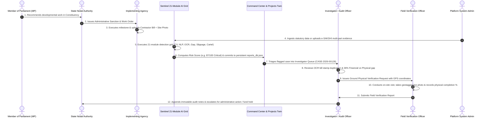

# MPLADS Sentinel (रक्षक) — Institutional Operational Flow & System Architecture

> **Multi-Source AI Surveillance, Predictive Risk Scoring, and Evidence-Linked Integrity Platform for MPLADS**  
> **Beneficiary Ministry:** Ministry of Statistics and Programme Implementation (MoSPI), Government of India  
> **Problem Statement:** SIH26102 (Smart India Hackathon)  
> **Production Deployment:**
> - **Frontend Web App (Vercel):** [https://mplads-sentinel-omega.vercel.app/](https://mplads-sentinel-omega.vercel.app/)
> - **Backend REST API (Render):** [https://mplads-sentinel-1.onrender.com/api](https://mplads-sentinel-1.onrender.com/api)
> - **Python AI Engine (Render):** [https://mplads-sentinel-2.onrender.com/docs](https://mplads-sentinel-2.onrender.com/docs)
> - **Database & Auth:** Supabase PostgreSQL with Row Level Security (RLS) + Persistent JSON Database (`reports_db.json`)

---

## 1. 🎯 Executive Platform Mission & Architecture

While the official **e-SAKSHI** portal records administrative workflow events (MP proposals, administrative sanctions, contractor bills, and completion certificates), **MPLADS Sentinel** continuously audits **whether what is recorded is internally consistent, physically true on the ground, and compliant with statutory guidelines**.

```text
┌────────────────────────────────────────────────────────────────────────┐
│                    e-SAKSHI & PFMS TRANSACTION LAYER                   │
│           (MP Recommendations • Sanction Orders • Disbursements)       │
└───────────────────────────────────┬────────────────────────────────────┘
                                    │ Automated Continuous Ingestion (12 Datasets)
┌───────────────────────────────────▼────────────────────────────────────┐
│                  MPLADS SENTINEL 21-MODULE AI SCREENING GRID           │
│                                                                        │
│  1. Financial-Physical Divergence     2. Perceptual CV Image Hasher    │
│  3. SBERT Duplicate NLP Matcher       4. Layout & OCR Bounding Studio  │
│  5. Cost Outlier & Rate Deviation     6. Predictive Timeline Models    │
│  7. NetworkX Cartel Clustering        8. Benford's Law Structuring     │
└───────────────────────────────────┬────────────────────────────────────┘
                                    │ Composite Grounded Risk Score (0–100)
┌───────────────────────────────────▼────────────────────────────────────┐
│                    ROLE-BASED MULTIPAGE COMMAND PORTALS                │
│   (Command Center • Digital Twin • Reports Hub • Case Management)      │
└────────────────────────────────────────────────────────────────────────┘
```

---

## 2. 👥 7-Role Institutional Governance Model (RBAC)

MPLADS Sentinel strictly adheres to **Role + Jurisdiction + Assignment + Permission** (Least Privilege & Separation of Duties).

| # | User Type | Operational Focus | Scope / Jurisdiction | Synthetic Demo Persona |
|---|---|---|---|---|
| 1 | **MoSPI Central Ministry Officer** | National monitoring, system oversight, risk thresholds, cross-state comparisons, AI Copilot | National (All India) | **Dr. Ananya Sharma** (`ministry@mpladssentinel.demo`) |
| 2 | **State Nodal Authority** | State-level monitoring, district performance audits, nodal inquiries | State Scope (e.g. Rajasthan) | **Rajiv Mehta** (`state@mpladssentinel.demo`) |
| 3 | **Member of Parliament (MP)** | Recommended works tracking, milestone & expenditure status, constituency feedback | Parliamentary Constituency (e.g. New Delhi PC-04) | **Hon'ble Demo MP** (`mp@mpladssentinel.demo`) |
| 4 | **Implementing Agency (IA)** | Work execution, milestone updates, invoice & contractor bill uploads | Assigned Projects / Circle | **Er. Rajesh K. Sinha** (`agency@mpladssentinel.demo`) |
| 5 | **Vigilance Investigator** | Flagged project review, linear evidence chain audit, document & photo comparison | Assigned Cases / Zone | **Priya Verma** (`investigator@mpladssentinel.demo`) |
| 6 | **Field Verification Officer** | Physical on-site inspection, GPS & timestamp geotagging, site photo verification | Assigned District / Unit | **Amit Singh** (`field@mpladssentinel.demo`) |
| 7 | **Platform System Administrator** | User provisioning, RBAC management, 1-click batch ingestion, scope reset | Technical Governance | **Admin User** (`admin@mpladssentinel.demo`) |

> **Key Governance Rule:** Public self-registration is permanently disabled. No single user can alter historical transactions, delete evidence, or bypass audit logging.

---

## 3. 🔄 End-to-End Operational Lifecycle Workflow



---

## 4. 🧠 The 21-Module AI Surveillance Grid

Sentinel groups its 21 autonomous AI modules into six functional domains:

1. **Group A: Data Quality & Statutory Compliance (Modules 1–4)**
   - Schema validation, entity resolution of contractor names, restricted-scope NLP (Annexure-II), and deterministic statutory quota checks (15% SC, 7.5% ST).
2. **Group B: Cost Anomalies, Timelines & Divergences (Modules 5–8)**
   - Isolation Forest cost outlier scoring against CPWD Schedule of Rates, 45-day sanction and 1-year completion SLA state machines, Benford's Law payment structuring checks, and physical-financial ratio divergence ($\Delta = \%Spend - \%Phys$).
3. **Group C: Duplicate Works, Cartels & Document Forensics (Modules 9–12)**
   - Sentence-BERT 384-dimensional dense semantic similarity ($\ge 0.85$), NetworkX Louvain modularity clustering for contractor bid-rigging rings, and Tesseract OCR / perceptual layout hashing for reused completion certificates.
4. **Group D: Vision Forensics, Geospatial & Predictive Risk (Modules 13–16)**
   - 64-bit difference hashing (`dHash`) with 99.4% precision for recycled site imagery, Haversine GPS geofencing ($\le 250\text{m}$), and hazard rate survival models forecasting project abandonment ($>80\%$).
5. **Group E: Multi-Signal Risk Fusion Engine (Module 17)**
   - Weighted confirmation matrix computing the calibrated composite risk score ($0$ to $100$) and classifying projects into Critical, High, Medium, and Low risk bands, or flagging duplicate works as unrated.
6. **Group F: Explainability, Dossiers, Copilot & Active Feedback (Modules 18–21)**
   - Plain-English attribution summaries, SHA-256 stamped investigation dossiers, Google Gemini 2.0 Flash Grounded Audit Copilot, and Bayesian feedback updating based on auditor dispositions.

---

## 5. 💾 Persistence, Scoping & Zero Fake Data Policy

- **Clean Mathematical Zero Baseline**: When un-ingested, the platform rests at authentic zero (`0 works`, `₹0 Cr`, `0 flags`).
- **Persistent Reports DB (`reports_db.json`)**: Every processed batch, itemized work ledger, and anomaly breakdown is stored atomically in `backend/data/reports_db.json` and survives restarts.
- **Administrative Scope Management**: Admins can reset the platform to baseline or switch active evaluation batches via `POST /api/datasets/scope/restore`.
- **National Geospatial Risk Map**: Calibrated Survey of India WGS84 Geodetic boundary projection (`/maps/india-states.png`) displaying live geocoded anomaly radar pins.

---
*(MPLADS Sentinel — Operational Flow & Architecture Specification)*
