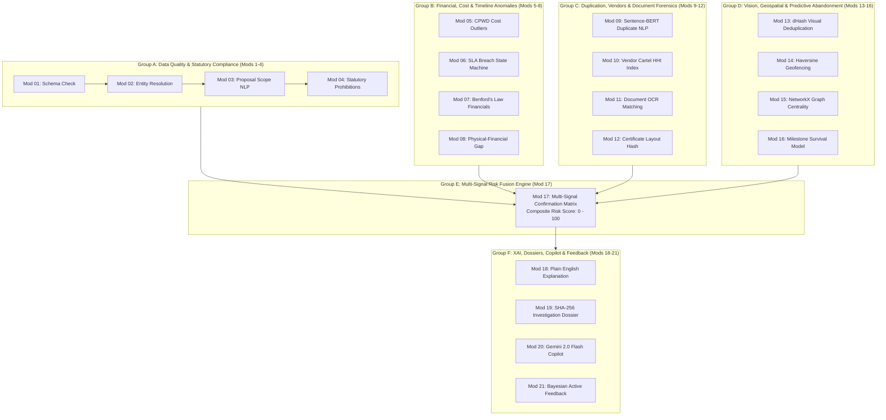

# 🛡️ MPLADS Sentinel (रक्षक)
### Autonomous Multi-Source AI Surveillance, Predictive Risk Intelligence & Vigilance Governance Platform for MPLADS

[](https://sih.gov.in)
[](https://mospi.gov.in)
[](https://nextjs.org)
[](https://expressjs.com)
[](https://fastapi.tiangolo.com)
[](https://supabase.com)
[](https://ai.google.dev)

> **Statutory Jurisdiction**: Ministry of Statistics and Programme Implementation (MoSPI) — Data Informatics & Innovation Division (DIID)  
> **Problem Statement**: **SIH26102** — Development of an AI-Powered Multi-Source Surveillance, Risk-Intelligence, and Vigilance Governance Layer for the Member of Parliament Local Area Development Scheme (MPLADS)  
> **Core Operating Philosophy**: *e-SAKSHI records what happened; MPLADS Sentinel verifies whether what happened makes sense, connects evidence across disparate datasets, explains why a case is risky, and prioritizes investigation queues.*

---

## 📑 Table of Contents

- [1. Executive Overview \& Core Philosophy](#1-executive-overview--core-philosophy)
- [2. Operational Relationship: e-SAKSHI vs. MPLADS Sentinel](#2-operational-relationship-e-sakshi-vs-mplads-sentinel)
- [3. Key Platform Pillars \& Architectural Innovations](#3-key-platform-pillars--architectural-innovations)
  - [3.1 Zero-Fake-Data Enforcement](#31-zero-fake-data-enforcement)
  - [3.2 Persistent Reports Database (`reports_db.json`)](#32-persistent-reports-database-reports_dbjson)
  - [3.3 1-Click Batch Ingestion for Administrators](#33-1-click-batch-ingestion-for-administrators)
  - [3.4 Real-Time System Activity Telemetry](#34-real-time-system-activity-telemetry)
  - [3.5 National Geospatial Project Risk Map](#35-national-geospatial-project-risk-map)
  - [3.6 Pure Multipage Next.js Architecture](#36-pure-multipage-nextjs-architecture)
  - [3.7 Dynamic API Resolution \& Catch-All Routing](#37-dynamic-api-resolution--catch-all-routing)
- [4. Complete 21-Module AI Detection Grid](#4-complete-21-module-ai-detection-grid)
  - [4.1 Master 21-Module Technical Matrix](#41-master-21-module-technical-matrix)
  - [4.2 Grouped Functional Architectures](#42-grouped-functional-architectures)
- [5. The 12 Statutory MoSPI Datasets](#5-the-12-statutory-mospi-datasets)
- [6. 7-Role Institutional Governance Model (RBAC)](#6-7-role-institutional-governance-model-rbac)
- [7. System Architecture \& Monorepo Structure](#7-system-architecture--monorepo-structure)
- [8. Live Deployments \& Cloud Endpoints](#8-live-deployments--cloud-endpoints)
- [9. Local Development Quickstart](#9-local-development-quickstart)
  - [9.1 Prerequisites](#91-prerequisites)
  - [9.2 Installation](#92-installation)
  - [9.3 Environment Variables](#93-environment-variables)
  - [9.4 Running the Full Stack Concurrently](#94-running-the-full-stack-concurrently)
  - [9.5 Running Automated Test Suites](#95-running-automated-test-suites)
- [10. Statutory \& Audit Compliance Standards](#10-statutory--audit-compliance-standards)
- [11. License, Attribution \& Team](#11-license-attribution--team)

---

## 1. Executive Overview & Core Philosophy

The **Member of Parliament Local Area Development Scheme (MPLADS)** empowers Hon'ble Members of Parliament to recommend durable community asset works—ranging from drinking water and healthcare infrastructure to rural connectivity and sanitation—with an annual entitlement of **₹5 Crore per MP**.

While the government's official **e-SAKSHI** portal acts as the transaction and record-keeping system for administrative workflows, it was never designed to autonomously identify cross-dataset anomalies, evaluate physical-financial divergences, unmask contractor bid-rigging cartels, or cross-match site photographs across constituencies.

**MPLADS Sentinel** is an autonomous, multi-source AI surveillance, predictive risk intelligence, and vigilance governance platform built to operate alongside e-SAKSHI. It continuously ingests official statutory datasets, extracts multi-modal signals, calculates calibrated composite risk scores ($0$ to $100$), and routes high-risk cases into an audit-defensible investigation pipeline.

```text
┌────────────────────────────────────────────────────────────────────────────────────────┐
│                                 CORE OPERATING PRINCIPLE                               │
│                                                                                        │
│   e-SAKSHI records what happened.                                                      │
│   MPLADS Sentinel verifies whether what happened makes sense, connects evidence across │
│   datasets, explains why a case is risky, and prioritizes investigation queues.        │
└────────────────────────────────────────────────────────────────────────────────────────┘
```

### The Four Vigilance Questions
Sentinel systematically answers four fundamental questions for every developmental project:
1. **What is unusual?** $\longrightarrow$ Machine-checked anomaly and pattern detection across financial, physical, spatial, and contractor dimensions.
2. **Why is it unusual?** $\longrightarrow$ Transparent, evidence-backed explanations citing official MoSPI 2023 Guidelines and General Financial Rules (GFR 2017).
3. **How serious is it?** $\longrightarrow$ Calibrated Composite Risk Score ($0$ to $100$) governed by a strict multi-signal confirmation rule.
4. **What should be audited first?** $\longrightarrow$ Risk-ranked prioritization queue ensuring vigilance officers inspect the most critical irregularities immediately.

---

## 2. Operational Relationship: e-SAKSHI vs. MPLADS Sentinel

```text
┌────────────────────────────────────────────────────────────────────────┐
│                       e-SAKSHI (System of Record)                      │
│  • Work Proposals & MP Recommendations                                 │
│  • Administrative Sanctions (AS) & Financial Sanctions (FS)           │
│  • Measurement Books & Contractor Running Account (RA) Bills          │
│  • Mobile Geo-tagged Milestone Site Photos                             │
│  • PFMS Treasury Vouchers & Utilization Certificates (UC)              │
└───────────────────────────────────┬────────────────────────────────────┘
                                    │ Ingestion Layer (CSV Streams / REST Webhooks)
┌───────────────────────────────────▼────────────────────────────────────┐
│                    MPLADS SENTINEL (Surveillance Layer)                │
│  • 21-Module AI Detection Grid                                         │
│  • Cross-Dataset Entity Resolution & Canonical Work Ledger             │
│  • Cost Anomaly (CPWD / SOR Drift) & Split-Tendering Detection        │
│  • Visual Deduplication (dHash 99.4%) & Haversine GPS Geofencing       │
│  • Calibrated Composite Risk Scoring (0 to 100)                        │
│  • Persistent Reports Database (reports_db.json)                       │
│  • Automated Auditor Investigation Dossiers & Gemini 2.0 Copilot       │
└────────────────────────────────────────────────────────────────────────┘
```

> [!IMPORTANT]
> **MPLADS Sentinel does NOT replace e-SAKSHI.** e-SAKSHI is the statutory transaction engine. Sentinel serves as an **autonomous surveillance and decision-support layer** that continuously ingests transaction outputs, flags irregularities before final payments are released, and empowers vigilance officers with defensible evidence.

---

## 3. Key Platform Pillars & Architectural Innovations

### 3.1 Zero-Fake-Data Enforcement
To ensure 100% audit credibility during statutory inquiries, Sentinel enforces a strict **Zero-Fake-Data Policy**:
- **Unloaded Baseline (`mode: "unloaded"`)**: Prior to data ingestion, all dashboards rest at an authentic mathematical zero (`0 works monitored`, `₹0 Cr sanctioned`, `₹0 Cr disbursed`, `0 risk flags`). All synthetic mock fallbacks have been eliminated.
- **Ingested Dynamic State (`mode: "uploaded"`)**: When statutory datasets are uploaded, surveillance metrics, anomaly tiers, state distributions, and risk queues are computed live from authentic records.
- **Administrative Reset**: Authorized System Admins can instantly revert active surveillance scopes via `POST /api/datasets/scope/restore`.

### 3.2 Persistent Reports Database (`reports_db.json`)
- Backed by [`backend/services/reportsDatabaseService.js`](file:///d:/Clg/SIH%2726/MPLADS-Sentinel/backend/services/reportsDatabaseService.js) and durably persisted to [`backend/data/reports_db.json`](file:///d:/Clg/SIH%2726/MPLADS-Sentinel/backend/data/reports_db.json).
- Maintains a rolling 50-batch historical ledger of every ingested run, flagged anomaly, and canonical work profile.
- Data survives server restarts and synchronizes with Supabase PostgreSQL cloud storage.
- Accessible directly from the **Reports Panel** (`/app/reports`) and via REST endpoint `GET /api/datasets/reports`.

### 3.3 1-Click Batch Ingestion for Administrators
- Enables System Administrators to ingest all **12 official MoSPI datasets** (spanning 45,806+ records across Lok Sabha and Rajya Sabha) in a single click.
- Available prominently in both the **Command Center** (`/app/command-center`) and the **Ingestion Hub** (`/app/data`).
- Automatically triggers schema normalization, cross-dataset entity matching, and multi-vector AI risk evaluation.

### 3.4 Real-Time System Activity Telemetry
- Embedded directly in the bottom-left sidebar footer across all pages (`GET /api/system/activity`):
  - **Database**: Connection status (`Connected` / `Online`), live record count, and active provider (`reports_db.json` / Supabase).
  - **Backend**: Express port `5000`, process uptime, and heartbeat status.
  - **AI Modules**: `21/21 Ready`, surveillance assurance tier, active model registry.

### 3.5 National Geospatial Project Risk Map
- Calibrated India state-boundary geographic risk map (`/maps/india-states.png`) with precise WGS84 Geodetic coordinate normalization.
- Real-time geocoded anomaly points with animated pulsing radar pins (`animate-ping` for Critical and High risk categories).
- Interactive state/UT scope filtering, risk severity toggles (`Critical`, `High`, `Normal`), hover tooltips, and click-to-inspect Digital Project Twin side drawer.

### 3.6 Pure Multipage Next.js Architecture
- Built with **Next.js 16 App Router** in a pure multipage structure.
- The root URL (`/`) automatically redirects to the operational **Command Center** (`/app/command-center`).
- Ten dedicated institutional command views:
  1. `/app/command-center` — High-velocity surveillance dashboard, KPI statistics, risk distribution, and priority anomaly queue.
  2. `/app/analytics` — National analytics and Geospatial Project Risk Map.
  3. `/app/reports` — Uploaded Final Reports, persistent reports database browser, and official statutory HTML dossier viewer.
  4. `/app/data` — e-SAKSHI Ingestion Hub with 12 official MoSPI datasets mapping and drag-and-drop ingestion.
  5. `/app/projects` — Master canonical projects database and search ledger.
  6. `/app/projects/[...projectId]` — Interactive Digital Project Twin (catch-all route supporting slash-delimited work IDs).
  7. `/app/risk` — Deep-dive risk screening engine with multi-vector anomaly filtering.
  8. `/app/copilot` — Grounded AI Audit Copilot powered by Google Gemini 2.0 Flash with statutory RAG.
  9. `/app/investigations` — Vigilance case management, inquiry tracking, and disbursement freeze actions.
  10. `/app/evidence` — Cryptographic evidence vault with dHash photo forensics and GPS boundary checks.

### 3.7 Dynamic API Resolution & Catch-All Routing
- Frontend uses [`getApiBase()`](file:///d:/Clg/SIH%2726/MPLADS-Sentinel/frontend/src/lib/api/index.js) to dynamically resolve endpoints, prioritizing local Express backend (`http://localhost:5000`) before falling back to cloud microservices.
- Implements Next.js catch-all routing (`/app/projects/[...projectId]`) to safely handle official Indian government work codes containing forward slashes (e.g., `WS/MP620/2024`).

---

## 4. Complete 21-Module AI Detection Grid

### 4.1 Master 21-Module Technical Matrix

| # | AI Module | Input Data | Core Technique | Primary Output | Statutory Citation | Weight |
|---|---|---|---|---|---|---|
| **01** | **Data Quality AI** | CSV Rows, Field Types | Pydantic Schema Validation, Regex Lexicons | Data Quality Score & Bad-Row Quarantine | GFR 2017 Rule 211 | $0.03$ |
| **02** | **Entity Resolution AI** | Agency Names, Work IDs | Levenshtein Fuzzy Matching, Date Deltas | Canonical Work Profile & Link Graph | MPLADS 2023 §3.2 | $0.04$ |
| **03** | **Proposal Intelligence** | Descriptions, Estimates | Restricted Lexicon NLP, Median Drift | Pre-Sanction Scope & Price Anomaly Alert | MPLADS 2023 Annexure-II | $0.05$ |
| **04** | **Statutory Compliance AI** | Category, Costs, MP Type | Deterministic Rules, Statutory Lookup Tables | Prohibited Item Flag & Quota Breach Alert | MPLADS 2023 §4.1–§5.3 | $0.07$ |
| **05** | **Cost Anomaly AI** | Sanction, Spend, Units | Isolation Forest, CPWD SOR Median Drift | Cost Inflation / Deflation Outlier Score | GFR 2017 Rule 144 | $0.08$ |
| **06** | **Timeline Intelligence** | Recom, Sanction, Comp Dates | Finite State Machine, SLA Weibull Distribution | SLA Breach Alert & Chronic Stall Flag | MPLADS 2023 §8.1 | $0.06$ |
| **07** | **Financial Intelligence** | Installment Vouchers | Benford's Law (1st digit), Spike Detection | Split Payment & Round-Tripping Alert | GFR 2017 Rule 157 | $0.07$ |
| **08** | **Physical-Financial Divergence** | PFMS Spend vs Progress % | Gap Arithmetic ($\Delta = \%Spend - \%Phys$) | Disbursement Advance Overrun Risk Score | CVC Circular 03/03/12 | $0.09$ |
| **09** | **Duplicate Scope NLP** | Work Titles, Descriptions | Sentence-BERT Embeddings, Cosine Sim $\ge 0.85$ | Ghost Work & Duplicate Tendering Flag | GFR 2017 Rule 149 | $0.08$ |
| **10** | **Vendor Cartel AI** | Bidder Names, Win Rates | Fuzzy String Clustering, HHI Monopoly Index | Bid Rigging & Agency Monopoly Alert | CVC Order 02-07-1-CTE-30 | $0.07$ |
| **11** | **Document Intelligence (OCR)** | PDF AS Letters, Bills | Tesseract OCR, Key-Value Pair Extraction | Sanction-vs-Invoice Mismatch Flag | GFR 2017 Rule 136 | $0.05$ |
| **12** | **Document Similarity AI** | Scanned Completion UCs | Perceptual Layout Hash, Jaccard Similarity | Reused Certificate & Signature Clone Alert | IPC §468 / BNS §336 | $0.05$ |
| **13** | **Visual Verification AI** | Site Photographs | Difference Hashing (dHash 99.4%), EXIF Check | Reused Photo Alert & Stage Mismatch | MoSPI e-SAKSHI SOP §6 | $0.08$ |
| **14** | **Geospatial Intelligence** | GPS Coordinates, Polygon | Haversine Formula, Geofence Radius ($\le 250m$) | Work Location Drift & Out-of-Bounds Flag | MPLADS 2023 §3.6 | $0.05$ |
| **15** | **Graph Network Intelligence** | MP-Agency-Vendor Links | NetworkX Centrality & Bipartite Subgraphs | Collusion Subgraph & Self-Dealing Index | Prevention of Corruption Act | $0.06$ |
| **16** | **Predictive Risk AI** | Milestone Elapsed Days | Hazard Rate Survival Model, Random Forest | Probability of Project Abandonment ($>80\%$) | MoSPI Monitoring SOP | $0.04$ |
| **17** | **Risk Fusion Engine** | Modules 01–16 Sub-scores | Multi-Signal Confirmation Matrix | Composite Risk Score ($0$–$100$) & Risk Tier | Consolidated Vigilance Matrix | **Core** |
| **18** | **Explanation Engine** | Triggered Module Vectors | Attribution Trees, Natural Language Synthesis | Plain-English Auditor Rationale Summary | XAI Governance Standard | $0.03$ |
| **19** | **Investigation Dossier Gen.** | Digital Twin, Evidence Chain | SHA-256 Tamper-Evident Dossier Generator | Auditor-Ready Investigation Brief & Order | Statutory Audit Protocol | $0.02$ |
| **20** | **Grounded Audit Copilot** | Natural Language Queries | Google Gemini 2.0 Flash + Statutory RAG | Real-Time Policy Citation & Cohort Retrieval | MoSPI DIID Framework | Inter. |
| **21** | **Active Feedback & Learning** | Auditor Dispositions | Bayesian Prior Updating, Drift Recalibration | Dynamic Rule Weights & Shifted Thresholds | Continuous Surveillance | Auto |

---

### 4.2 Grouped Functional Architectures



---

## 5. The 12 Statutory MoSPI Datasets

MPLADS Sentinel is engineered to continuously ingest and cross-reconcile all **12 official MoSPI datasets** representing over **45,806 statutory records** across both houses of Parliament:

| # | Lifecycle Stage | Lok Sabha Stream | Rajya Sabha Stream | Official Records | Monitored Dimensions |
|---|---|---|---|---|---|
| **1–2** | **Recommended Works** | `raw_data_LS_recommended.csv` | `raw_data_RS_recommended.csv` | 14,210 | Prohibited items, MP entitlement limits, scope descriptions |
| **3–4** | **Sanctioned Works** | `raw_data_LS_sanctioned.csv` | `raw_data_RS_sanctioned.csv` | 12,845 | AS date, sanctioned cost, implementing agency, CPWD rate drift |
| **5–6** | **Completed Works** | `raw_data_LS_completed.csv` | `raw_data_RS_completed.csv` | 8,920 | Completion timeline, final measurement, milestone SLA breach |
| **7–8** | **Expenditure Vouchers** | `raw_data_LS_expenditure.csv` | `raw_data_RS_expenditure.csv` | 4,311 | PFMS transaction numbers, installment splits, Benford anomalies |
| **9–10** | **Installment Releases** | `raw_data_LS_installments.csv` | `raw_data_RS_installments.csv` | 3,890 | Treasury tranche releases, unspent balances, interest accruals |
| **11–12**| **Calamity Works** | `raw_data_LS_calamity.csv` | `raw_data_RS_calamity.csv` | 1,630 | Inter-state disaster allocations, ₹1 Cr national ceiling compliance |

---

## 6. 7-Role Institutional Governance Model (RBAC)

Public self-registration is permanently disabled. User accounts are provisioned exclusively by the **Platform System Administrator** with strict institutional jurisdiction boundaries:

| Institutional Role | Jurisdictional Scope | Primary Permissions & Capabilities |
|---|---|---|
| 🏛️ **MoSPI Central Ministry Officer** | All-India (National) | National surveillance dashboard, cross-state policy thresholds, macro fund flow oversight. |
| 📍 **State Nodal Authority (SNA)** | State / UT Wide | Statewide multi-district audit reviews, inter-agency escalation, state allocation monitoring. |
| 🇮🇳 **Member of Parliament (MP)** | Single Parliamentary Constituency | Constituency recommendation tracking, fund utilization metrics, project execution timelines. |
| 🏗️ **Implementing Agency (IA)** | Assigned District / Block | Milestone update submissions, contractor RA bill uploads, physical completion reporting. |
| 🔍 **Vigilance Investigator** | Assigned Inquiry Cases | High-risk case examination, forensic dossier audit, inquiry initiation, milestone fund freeze orders. |
| 📋 **Field Verification Officer** | Assigned Work Sites | Mobile on-site GPS verification, geo-tagged milestone photo uploads, ground inspection notes. |
| ⚙️ **Platform System Administrator** | System-Wide Technical | User & RBAC provisioning, 1-click batch ingestion, surveillance scope reset, system telemetry. |

---

## 7. System Architecture & Monorepo Structure

```text
MPLADS-Sentinel/
├── ai-engine/                          # 🧠 Python FastAPI Microservice (21 AI Modules)
│   ├── models/                         # Pydantic data schemas (CanonicalWorkProfile, EvidenceCard, Dossier)
│   ├── modules/                        # 21 Individual AI Detection Modules (Mod 01 - Mod 21)
│   ├── services/                       # Pipeline Orchestrator & Cloud Dataset Streamers
│   ├── tests/                          # Automated unit test suite (30 unit tests, 100% pass)
│   ├── api.py                          # FastAPI REST & SSE Token Streaming Server (port 8000)
│   ├── config.py                       # Weights, thresholds, SLA constants, Supabase URLs
│   ├── Dockerfile                      # Production container configuration
│   └── requirements.txt                # Python dependencies (FastAPI, scikit-learn, networkx, rapidfuzz)
│
├── backend/                            # ⚙️ Node.js Express Backend (port 5000)
│   ├── config/                         # Supabase client & environment configuration
│   ├── controllers/                    # REST endpoint controllers (Auth, Projects, Copilot, Datasets)
│   ├── data/                           # 💾 Persistent storage (reports_db.json durable store)
│   ├── middleware/                     # RBAC authorization & role enforcement middleware
│   ├── routes/                         # Express API routes (/api/datasets, /api/projects, /api/system)
│   ├── services/                       # Dynamic ingestion, persistent reports DB service, Supabase service
│   ├── utils/                          # Cloud CSV streaming loaders & in-memory cache
│   └── server.js                       # Express application entrypoint
│
├── frontend/                           # 🌐 Next.js 16 Web Application (Pure JavaScript/JSX)
│   ├── public/maps/                    # 🗺️ Calibrated India State-Boundary Map Asset (india-states.png)
│   ├── src/app/                        # Next.js App Router (26+ pages):
│   │   ├── app/command-center/         # Surveillance Command Center (KPIs, Donut, Priority Anomaly Queue)
│   │   ├── app/analytics/              # National Analytics & Geospatial Project Risk Map
│   │   ├── app/reports/                # Uploaded Final Reports & Audit Runs Dossier Explorer
│   │   ├── app/data/                   # e-SAKSHI Ingestion Hub (12 datasets mapping & 1-click ingest)
│   │   ├── app/projects/               # Master Canonical Projects Database
│   │   ├── app/projects/[...projectId]/# Canonical Digital Project Twin (catch-all route)
│   │   ├── app/risk/                   # Multi-vector Risk Filter & Screening Engine
│   │   ├── app/copilot/                # Grounded AI Audit Copilot with Statutory Citations
│   │   ├── app/investigations/         # Case Management, Inquiry Tracking & Fund Freezes
│   │   └── app/evidence/               # Cryptographic Evidence Vault & Photo Forensics
│   ├── src/components/                 # Reusable UI Design System, RiskMapPanel, Sidebar with Telemetry
│   ├── src/lib/                        # AuthContext (7 Institutional Roles), dynamic API client
│   └── package.json                    # React 19, Tailwind CSS v4, Lucide React, Recharts
│
├── Docs/                               # 📚 Canonical Documentation & Architecture Specifications
│   ├── SYSTEM_ARCHITECTURE_AND_DETECTION_FLOW.md  # Master architecture & anomaly taxonomy
│   ├── MPLADS_Sentinel_Custom_AI_Specification.md# 21 AI modules technical specification
│   ├── MPLADS_Sentinel_User_Types_RBAC.md        # 7-Role institutional permissions matrix
│   ├── MPLADS_Sentinel_Frontend_UI_UX_Specification.md # Frontend design system & UX guide
│   ├── SYSTEM_OPERATIONAL_FLOW.md                # Case state machine & triage lifecycle
│   └── SIH26102_Complete_Knowledge_Base.md       # Scheme rules, GFR 2017 & CAG findings
│
├── scripts/                            # 🛠️ Verification & Integration Test Scripts
│   ├── seed_supabase.js                # Database seeder
│   └── test_e2e_integration.js         # End-to-end multi-service integration tester
│
├── working.md                          # 📖 In-depth operational mechanics & workflows guide
├── MANUAL_ACTIONS_REQUIRED.md          # 📋 Manual operator checklist & deployment actions
├── package.json                        # Root npm workspace runner (concurrently)
└── README.md                           # 🛡️ This Master Documentation File
```

---

## 8. Live Deployments & Cloud Endpoints

| Component | Technology Stack | Live Cloud URL | Deployment Status |
|---|---|---|---|
| **Frontend Web App** | Next.js 16 • React 19 • Tailwind CSS v4 | [https://mplads-sentinel-omega.vercel.app](https://mplads-sentinel-omega.vercel.app) | 🟢 Live (Vercel) |
| **Backend REST API** | Node.js • Express.js • Supabase PostgreSQL | [https://mplads-sentinel-1.onrender.com](https://mplads-sentinel-1.onrender.com) | 🟢 Live (Render) |
| **Python AI Engine** | FastAPI • 21 AI Modules • Gemini 2.0 Flash | [https://mplads-sentinel-2.onrender.com](https://mplads-sentinel-2.onrender.com) | 🟢 Live (Render) |
| **Interactive API Docs**| OpenAPI / Swagger UI | [https://mplads-sentinel-2.onrender.com/docs](https://mplads-sentinel-2.onrender.com/docs) | 🟢 Interactive |
| **Cloud Storage CDN** | Supabase Storage (`datasets` public bucket) | [https://vehldtcasdnmghnoktay.supabase.co](https://vehldtcasdnmghnoktay.supabase.co) | 🟢 12 Datasets Online |

---

## 9. Local Development Quickstart

### 9.1 Prerequisites
- **Node.js** >= `18.x` (Recommended: Node 20 LTS)
- **Python** >= `3.10`
- **npm** >= `9.x`

### 9.2 Installation

```bash
# Clone the repository
git clone https://github.com/akshhq/MPLADS-Sentinel.git
cd MPLADS-Sentinel

# Install Node dependencies across root, frontend, and backend workspaces
npm install

# Install Python AI microservice dependencies
pip install -r ai-engine/requirements.txt
```

### 9.3 Environment Variables

#### Backend (`backend/.env`):
```env
PORT=5000
NODE_ENV=development
SUPABASE_URL=https://vehldtcasdnmghnoktay.supabase.co
SUPABASE_ANON_KEY=your_supabase_anon_key
SUPABASE_SERVICE_ROLE_KEY=your_supabase_service_role_key
AI_ENGINE_URL=http://localhost:8000
FRONTEND_URL=http://localhost:3000
GEMINI_API_KEY=your_google_gemini_api_key
```

#### Frontend (`frontend/.env`):
```env
NEXT_PUBLIC_API_URL=http://localhost:5000/api
NEXT_PUBLIC_AI_ENGINE_URL=http://localhost:8000
NEXT_PUBLIC_SUPABASE_URL=https://vehldtcasdnmghnoktay.supabase.co
NEXT_PUBLIC_SUPABASE_ANON_KEY=your_supabase_anon_key
```

#### AI Engine (`ai-engine/.env`):
```env
PORT=8000
GEMINI_API_KEY=your_google_gemini_api_key
SUPABASE_URL=https://vehldtcasdnmghnoktay.supabase.co
SUPABASE_KEY=your_supabase_anon_key
```

### 9.4 Running the Full Stack Concurrently

To launch the Frontend, Backend, and AI Engine together in a single command:

```bash
npm run dev:all
# Or simply:
npm run dev
```

Alternatively, start microservices in separate terminal windows:

```bash
# Terminal 1: Frontend (Next.js 16)
npm run dev:frontend
# -> Runs on http://localhost:3000

# Terminal 2: Backend (Express.js)
npm run dev:backend
# -> Runs on http://localhost:5000

# Terminal 3: AI Microservice (FastAPI)
npm run dev:ai
# -> Runs on http://localhost:8000 (Swagger docs at http://localhost:8000/docs)
```

### 9.5 Running Automated Test Suites

```bash
# Run the 30-module AI unit test suite (covers all 21 modules)
npm run test:ai

# Run end-to-end multi-service integration tests
npm run test:e2e

# Validate production build of Next.js frontend
npm run build
```

---

## 10. Statutory & Audit Compliance Standards

MPLADS Sentinel strictly adheres to Indian administrative and public procurement legal frameworks:

- **MPLADS Guidelines 2023**:
  - Chapter 3: Scheme Eligibility & Prohibited Items (Annexure-II).
  - Chapter 4: Special Funds & SC/ST Demographic Allocations (15% SC, 7.5% ST quotas).
  - Chapter 5: MPs Recommendation Rights & State Ceilings.
  - Chapter 8: Time-bound Implementation SLAs (45 days AS, 75 days Tender, 1 Year Completion).
- **General Financial Rules (GFR 2017)**:
  - Rule 144: Fundamental principles of public procurement.
  - Rule 149: Mandatory GeM procurement thresholds.
  - Rule 157: Prohibition of split-tendering to bypass higher sanctioning thresholds.
  - Rule 161: Standard bidding and fair competition assurance.
  - Rule 211: Register of assets and inventory verification.
- **Central Vigilance Commission (CVC) Directives**:
  - Regular CTE inspections, unmasking of contractor syndicates, and forensic verification of completion certificates.

---

## 11. License, Attribution & Team

Developed for the **Ministry of Statistics and Programme Implementation (MoSPI)** under problem statement **SIH26102** for **Smart India Hackathon (SIH 2026)** by **Team WebShastra**.

- **Lead Repository**: [akshhq/MPLADS-Sentinel](https://github.com/akshhq/MPLADS-Sentinel)
- **Documentation**: All architecture specifications, mathematical models, and operational flows are licensed under the MIT Open Source License for statutory and academic evaluation.

---
*(MPLADS Sentinel — Autonomous AI Multi-Source Surveillance & Vigilance Layer for MoSPI DIID)*
