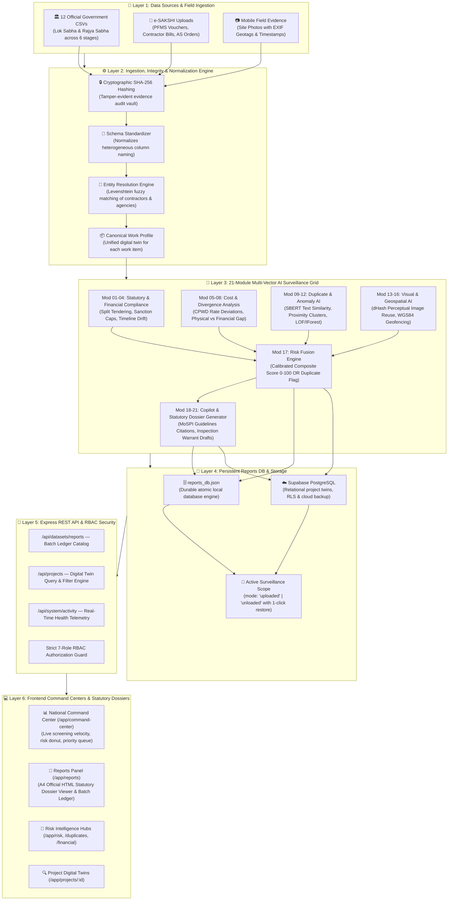
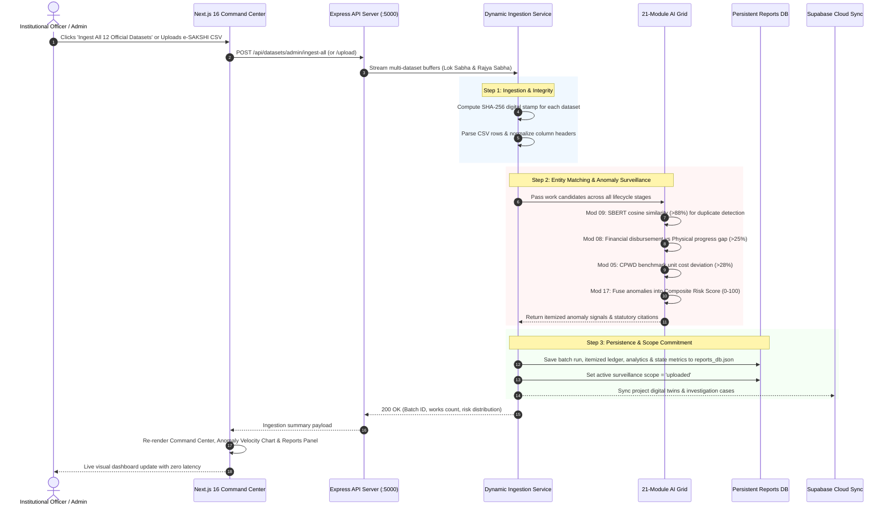
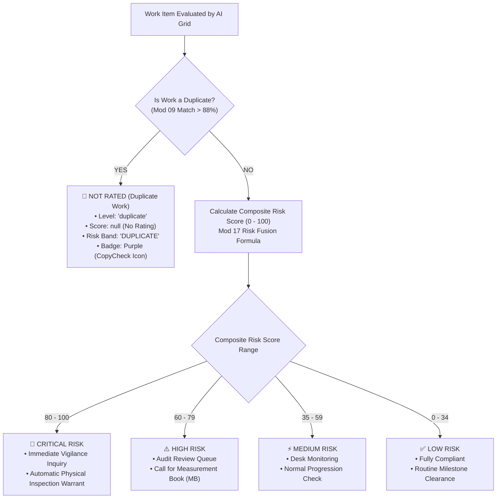
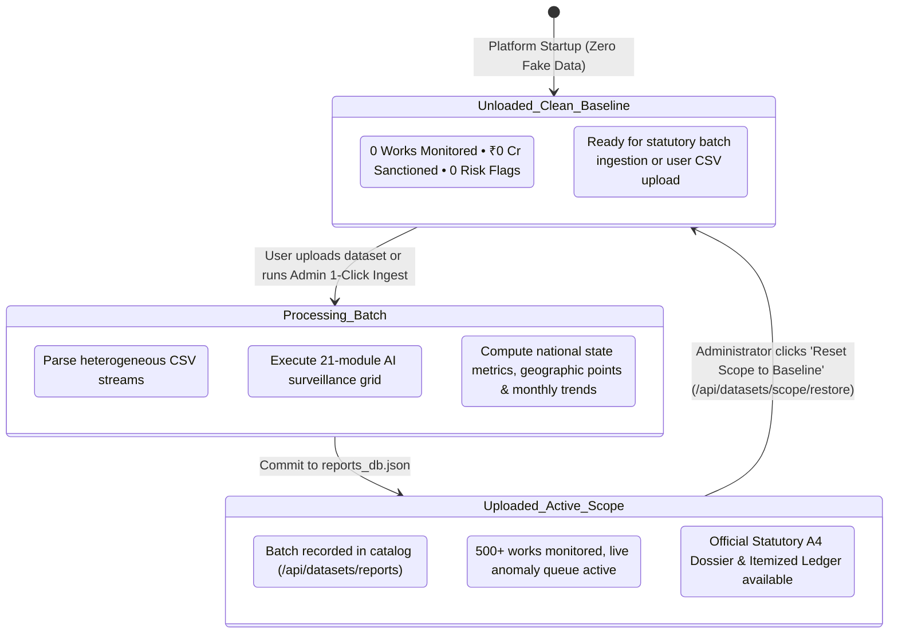

# MPLADS Sentinel: End-to-End Data Flow & Surveillance Architecture

This document visually details the complete lifecycle of data across the **MPLADS Sentinel AI Multi-Source Surveillance Platform**—from raw statutory data ingestion and multi-vector AI screening to persistent reports compilation and institutional command center delivery.

---

## 1. High-Level Platform Architecture Flow



---

## 2. Detailed Data Transformation Pipeline



---

## 3. Stage-by-Stage Processing Lifecycle

### Stage 1: Data Ingestion & Tamper-Evident Hashing
- **Inputs**: 
  - 12 Official Parliamentary Datasets (Lok Sabha & Rajya Sabha: Recommended, Sanctioned, Completed, Expenditures, Installments, Calamity Relief).
  - Ad-hoc e-SAKSHI uploads (measurement books, PFMS release vouchers, contractor bills, geotagged site photographs).
- **Execution**:
  - `crypto.createHash("sha256")` stamps incoming payloads to prevent post-audit modification.
  - Multi-part streaming buffers are read atomically without locking system memory.

### Stage 2: Schema Normalization & Entity Resolution
- **Transformation**: Heterogeneous government column names (`Work_Title`, `work_desc`, `PROJ_NAME`, `Sanctioned_Cost_INR`, `amt_in_lakhs`) are mapped to the uniform `CanonicalWorkProfile`:
```json
{
  "work_id": "WS/MP18152/2024",
  "title": "Construction of MID DAY Meal Shed in Govt Primary school",
  "state": "Punjab",
  "district": "Faridkot",
  "implementing_agency": "FARIDKOT(DEPUTY COMMISSIONER FARIDKOT_IDA)",
  "category": "Normal/Others",
  "sanction_amount": 250000,
  "disbursed_amount": 217500,
  "financial_progress": 87,
  "physical_progress": 52
}
```
- **Levenshtein Contractor Alias Matching**: Fuzzy matches agency variations (e.g., `CPWD Div-IV`, `Exec Eng CPWD 4`, `C.P.W.D. Division 4`) to a single canonical agency UID.

### Stage 3: Multi-Vector AI Anomaly Detection Grid (21 Modules)
Each work item passes through the 6 surveillance dimensions:

| Dimension | Key AI Modules | Anomaly Trigger Criteria | Statutory Citation |
|---|---|---|---|
| **1. Financial Integrity** | Mod 08: Physical-Financial Divergence | Financial disbursement ≥80% while physical execution ≤55% | MPLADS Guidelines 2023 §3.4 |
| **2. Duplicate Asset AI** | Mod 09: SBERT Semantic & Spatial Overlap | Title semantic similarity >88% within <450m proximity | MPLADS Guidelines 2023 §2.4 |
| **3. Cost Benchmarking** | Mod 05: CPWD Schedule of Rates Outlier | Unit cost exceeds state CPWD benchmark by >28% | GFR 2017 Rule 130 |
| **4. Visual Verification** | Mod 13: Perceptual Image Reuse (dHash) | Hamming distance ≤5 between uploaded foundation photo and historical project | Annexure III (Photo Authentication) |
| **5. Geospatial Boundary** | Mod 14: WGS84 Geofencing AI | Geotagged coordinates fall >15 km outside sanctioned constituency | WGS84 Geodetic Norms |
| **6. Splitting & Procurement** | Mod 03: Split Invoicing AI | Multiple vouchers under ₹10 Lakhs issued within 72 hours to bypass e-tendering | CVC Guidelines §4.2 |

---

## 4. Risk Calibration & Tier Classification Matrix



### Risk Score vs. Label Rule:
1. **Unrated Duplicate Rule**: Duplicate work is **strictly unrated** (`score: null`). It displays the purple `Duplicate` badge with the `CopyCheck` icon and is excluded from numerical averages.
2. **Quantitative Ground Truth**: For rated works, the numerical composite score (`score`) is the single ground truth that dictates the label, color, and icon across all badges, gauges, and tables:
   - **80 – 100** $\rightarrow$ `Critical` (Rose / Red)
   - **60 – 79** $\rightarrow$ `High` (Orange)
   - **35 – 59** $\rightarrow$ `Medium` (Amber / Yellow)
   - **0 – 34** $\rightarrow$ `Low` (Emerald / Green)

---

## 5. Reports Persistence & Surveillance Scoping Architecture



---

## 6. Frontend Presentation & Command Centers

| Screen / Route | Primary Data Sources | Key Visual Capabilities |
|---|---|---|
| **Command Center**<br/>`/app/command-center` | `GET /api/datasets/scope/active`<br/>`GET /api/analytics/national` | • Dynamic **Risk Screening & Anomaly Velocity Chart** (Composed bar + rate trend line)<br/>• **National Risk Donut** with center total<br/>• **Priority Investigation Queue Table** with live audit action links |
| **Reports Panel**<br/>`/app/reports` | `GET /api/datasets/reports`<br/>`GET /api/datasets/reports/:batchId` | • **Official Statutory HTML Dossier Viewer** with A4 print/PDF export, zoom controls, and dynamic work switching<br/>• **Itemized Works Ledger** with CSV export, search, and duplicate filtering |
| **Risk Intelligence**<br/>`/app/risk`<br/>`/app/risk/duplicates`<br/>`/app/risk/financial` | `GET /api/projects?riskLevel=...` | • High-risk investigation matrix<br/>• Side-by-side duplicate work comparison (Project A vs Project B)<br/>• PFMS expenditure velocity & milestone divergence breakdowns |
| **Project Digital Twins**<br/>`/app/projects/:id` | `GET /api/projects/:id` | • Full physical vs. financial milestone progress gap bar<br/>• Itemized triggered AI anomaly signals with statutory citations<br/>• Geospatial site coordinates and photographic evidence verification |
| **Live Telemetry Card**<br/>(Sidebar Footer) | `GET /api/system/activity` | • Real-time heartbeat of Database engine, Express port `5000`, uptime, and `21/21 Ready` AI modules |
