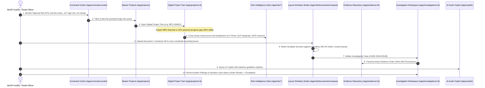

# MPLADS Sentinel (रक्षक) — System Operational Flow & Architecture

> **Institutional Platform Overview & End-to-End Operational Workflow**  
> **Beneficiary Ministry:** Ministry of Statistics and Programme Implementation (MoSPI), Government of India  
> **System Architecture:** Full MERN Stack (MongoDB, Express.js, React 19 / Next.js 16, Node.js) with Modular AI Verification Engines

---

## 1. 🎯 Executive Platform Mission

MPLADS Sentinel adds an explainable AI surveillance and evidence-linked risk prioritization layer over eSAKSHI. While eSAKSHI records what happened throughout the project lifecycle (proposals, administrative sanctions, contractor payments, completion certificates), Sentinel continuously verifies **whether what happened is internally consistent, supported by ground evidence, and compliant with statutory guidelines**.

```
┌────────────────────────────────────────────────────────┐
│             eSAKSHI / MPLADS WORKFLOW LAYER            │
│         (Proposals • Sanctions • PFMS Payments)        │
└──────────────────────────┬─────────────────────────────┘
                           │ Continuous Ingestion
┌──────────────────────────▼─────────────────────────────┐
│                 MPLADS SENTINEL ENGINE                 │
│                                                        │
│  • Cost Outlier Analysis   • Perceptual CV Image Match │
│  • Timeline Delay Model    • Layout / OCR Verification │
│  • Semantic Duplicate NLP  • Financial-Physical Gap    │
└──────────────────────────┬─────────────────────────────┘
                           │ Grounded Risk Scoring (0–100)
┌──────────────────────────▼─────────────────────────────┐
│              AUTHORIZED AUDITOR WORKSPACE              │
│       (Prioritized Case Queue • Evidence Chain)        │
└────────────────────────────────────────────────────────┘
```

---

## 2. 🔄 Complete End-to-End Operational Flow



---

## 3. 🏛️ Core Working Operational Modules

### 3.1 National Command Center (`/app/command-center`)
- **Real-Time Surveillance KPIs**: 18,432 total works screened, 127 high risk, 34 critical, ₹42.8 Cr cumulative flagged risk value.
- **National Risk Trends**: 7-day multi-line area chart tracking anomaly emergence.
- **Category Risk Donut**: Risk concentration across Community Infrastructure (26.1%), Roads (23.6%), Water & Sanitation (19.3%), and Renewable Energy (17.4%).
- **Priority Investigation Queue**: Live quick-triage cards with one-click navigation to Digital Twins.

### 3.2 Master Projects Directory (`/app/projects`)
- **Multi-Dimensional Query Filter**: Live filtering by State, District, Category, Risk Level (Critical, High, Medium, Low), and Status.
- **Visual Progress Divergence Indicator**: Simultaneous dual-bar rendering comparing Financial Disbursement % vs Physical Execution % with color-coded warning chips.
- **CSV Data Export**: One-click export of filtered audit cohorts.

### 3.3 Digital Project Twin (`/app/projects/[projectId]`)
- **Showcase Digital Twin (`MPL-004821` — Village Khera Community Hall)**:
  - **Financial Breakdown**: ₹35.0 L Sanctioned, ₹30.8 L Disbursed (88.0%), ₹18.2 L Physically Verified (52.0%).
  - **Explainable Anomaly Reasons Matrix**: 5 correlated multi-source triggers (Financial-Physical Gap, 99.4% CV Photo Reuse, 146-day Timeline Slippage, Scope Duplication with MPL-004822, ₹41L vs ₹35L Final Invoice Excess).
  - **Execution Milestone Stepper**: Chronological milestone audit tracking with delay tags and attached evidence.
  - **Direct Case Creation**: One-click action to spawn or open linked investigation cases.

### 3.4 Multi-Modal Risk Intelligence Suite (`/app/risk/*`)
- **Financial Intelligence (`/app/risk/financial`)**: Disproportionate milestone advance payouts, split-payment threshold circumvention, and vendor concentration analysis.
- **Timeline Intelligence (`/app/risk/timeline`)**: Critical-path delay tracking, stalled milestones, and forecasted completion delay models.
- **Duplicate Project Intelligence (`/app/risk/duplicates`)**: Side-by-side comparison of duplicate pairs (e.g. MPL-004821 vs MPL-004822) with SBERT NLP text similarity (92.4%) and GIS distance calculation (438 meters).
- **Document OCR Intelligence (`/app/risk/documents`)**: Cross-document reconciliation matrix comparing Administrative Sanction Orders, Work Orders, Contractor Invoices, and Utilization Certificates (GFR 12-A).
- **Visual Computer Vision Intelligence (`/app/risk/visual`)**: Perceptual image hashing detecting 99.4% photo reuse from North West Delhi archive photos and EXIF GPS distance offset (18.7 km).

### 3.5 Document & Layout Similarity Studio (`/app/risk/documents/compare`)
- **Drag-and-Drop Uploader**: Upload scanned contractor invoices, utilization certificates, or administrative sanction orders (PDF, PNG, JPG, TIFF).
- **Coordinate Bounding Box Matcher**: Automated visual overlay comparing Zone A (Letterhead Header), Zone B (Work Reference Metadata), Zone C (Expenditure Rate Schedules), and Zone D (Authority Seals & Signatures).
- **Deviation & Discrepancy Matrix**: Detects reused seal artifacts, +31.4% cost overruns over sanction, and typography inconsistencies.
- **Direct Investigation Link**: Launch a new investigation case directly from any matched duplicate candidate.

### 3.6 Cryptographic Evidence Repository (`/app/evidence/*`)
- **Evidence Catalog**: Search and filter cryptographic evidence items across Photo Proofs, Contractor Invoices, Treasury Vouchers, and UC Certificates.
- **Evidence Detail & Provenance (`/app/evidence/[evidenceId]`)**: Immutable SHA-256 hash inspection, EXIF metadata extraction, timestamp certification, and chain-of-custody verification.

### 3.7 Auditor Investigation Workspace (`/app/investigations/*`)
- **Case Management Queue**: Filter cases by Status (`new`, `under_review`, `evidence_requested`, `escalated`, `cleared`, `closed`) and Priority (`urgent`, `high`, `medium`, `low`).
- **Interactive Case Workspace (`/app/investigations/[caseId]`)**:
  - **Linear Evidence Chain**: Step-by-step visual chain (Anomaly Trigger → Risk Signal → Contractor Claim → Ground Evidence → Treasury Source).
  - **Official Notes Feed**: Timestamped auditor observations with attached evidence IDs.
  - **Audit Activity Log**: Immutable log of status transitions and officer actions.
  - **Printable Executive Brief**: Generates a clean, formal briefing document for administrative escalation.

### 3.8 Grounded AI Copilot (`/app/copilot`)
- **Natural Language Assistant**: Answers complex queries grounded exclusively in structured project records and statutory rules (MPLADS Guidelines 2023, GFR 2017 Rule 130).
- **Structured Findings Output**: Returns grounding risk signals, referenced evidence IDs, cited statutory clauses, and recommended verification steps.

### 3.9 Geospatial Analytics & Data Explorer (`/app/analytics` & `/app/data`)
- **National Geospatial Risk Map**: Interactive state-by-state geographic risk mapping with interactive state detail pages (`/app/analytics/states/[state]`).
- **Dataset Explorer (`/app/data`)**: Direct access to all **12 official CSV datasets** from MoSPI and eSAKSHI (Works Recommended, Works Sanctioned, Works Completed, Expenditures, Allocated Limits, Calamity Consents) with live search and column schemas.

---

## 4. 🛠️ Backend API Endpoints (MERN Stack)

| Endpoint | Method | Functionality |
|---|---|---|
| `/api/health` | `GET` | Service status and ministry metadata |
| `/api/projects` | `GET` | Filter, search, paginate, and sort monitored works |
| `/api/projects/:id` | `GET` | Fetch Digital Project Twin with milestones and risk reasons |
| `/api/projects/export/csv` | `GET` | Export filtered project cohorts to CSV |
| `/api/evidence` | `GET` | Query cryptographic evidence repository |
| `/api/evidence/:id` | `GET` | Fetch single evidence item with SHA-256 provenance |
| `/api/investigations` | `GET`, `POST` | List cases or create new investigation case |
| `/api/investigations/:id` | `GET` | Fetch case workspace details and evidence chain |
| `/api/investigations/:id/status` | `PATCH` | Transition case status and append activity log |
| `/api/investigations/:id/notes` | `POST` | Add investigator note with linked evidence IDs |
| `/api/copilot/query` | `POST` | Execute grounded AI RAG query with guideline citations |
| `/api/analytics/national` | `GET` | National KPI metrics, trends, and risk distributions |
| `/api/analytics/states` | `GET` | State-level aggregated risk metrics |
| `/api/analytics/states/:state` | `GET` | State deep-dive statistics and district list |
| `/api/analytics/geopoints` | `GET` | Geospatial map coordinate points |
| `/api/datasets` | `GET` | Metadata and columns for all 12 official CSV datasets |
| `/api/datasets/:id` | `GET` | Query and paginate rows from official CSV datasets |
| `/api/layout/compare` | `POST` | Upload file and compare coordinate bounding box similarity |
| `/api/layout/templates` | `GET` | Standard reference GFR-12A and CPWD bill templates |
| `/api/ai/proposal-check` | `POST` | Proposal cost deviation vs historical median benchmark |
| `/api/ai/duplicate-check` | `POST` | SBERT NLP text similarity + GIS distance evaluator |
| `/api/ai/vision-verify` | `POST` | Perceptual image hashing & EXIF GPS distance offset |
| `/api/ai/financial-physical-divergence`| `POST` | Financial % vs Physical % divergence score |
| `/api/ai/graph-network` | `GET` | Entity graph network nodes and vendor concentration |
| `/api/ai/predictive-risk` | `POST` | Predictive delay and cost overrun probabilities |
| `/api/ai/attack-simulator` | `POST` | Attack simulation with Before vs After risk delta |

---

## 5. 🚀 Execution Commands

```bash
# 1. Run the entire full-stack application concurrently:
npm run dev:all

# 2. Or run individual services:
npm run server    # Express.js REST API on http://localhost:5000
npm run dev       # Next.js React frontend on http://localhost:3000

# 3. Seed MongoDB database:
npm run seed

# 4. Production build verification:
npm run build
```
