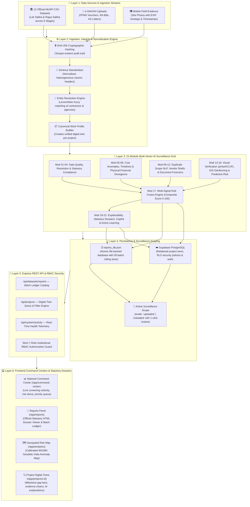
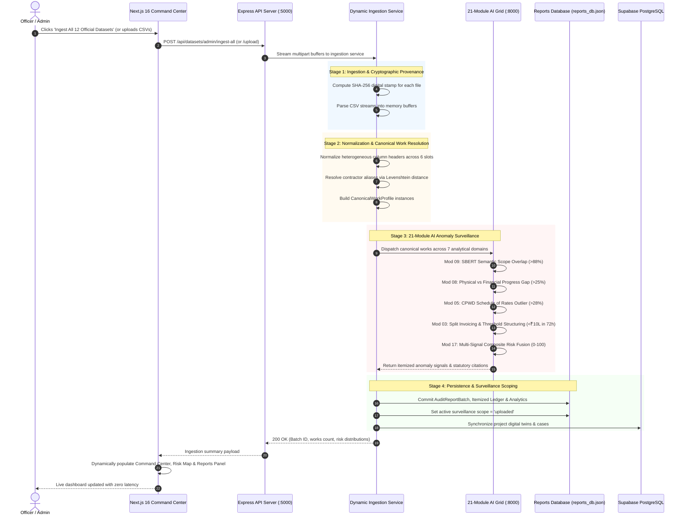
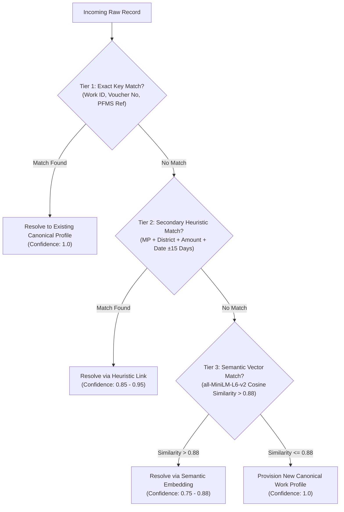
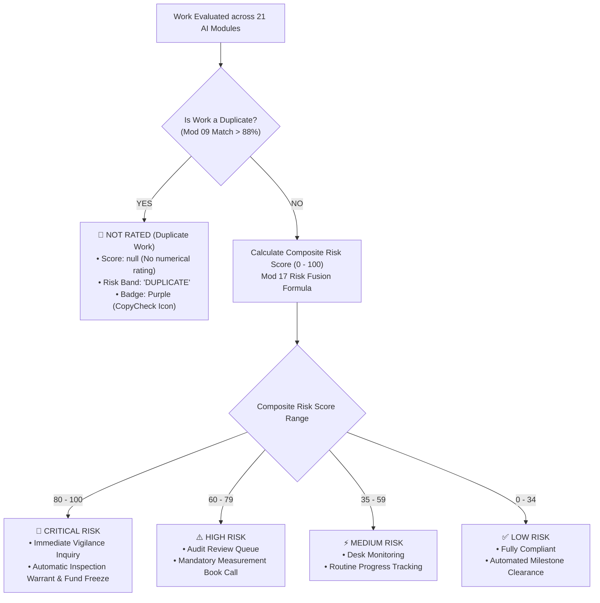
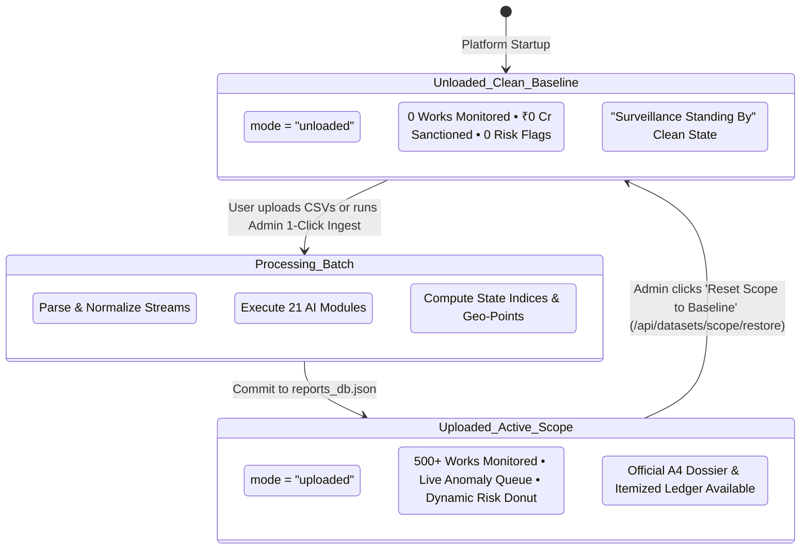
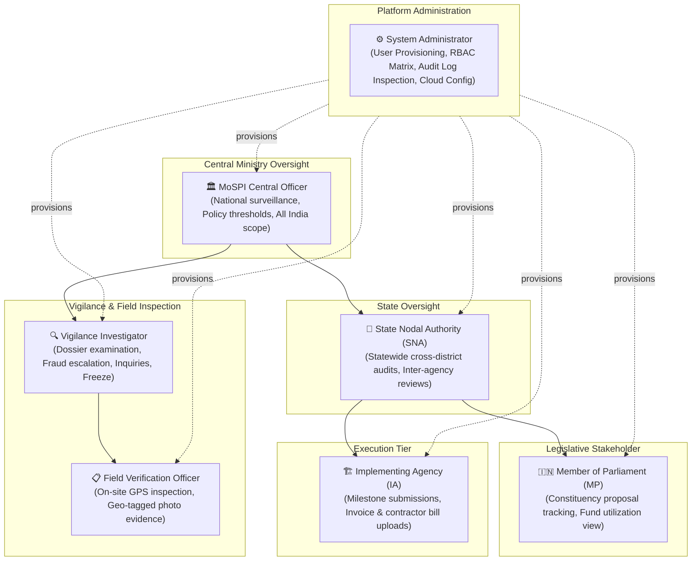
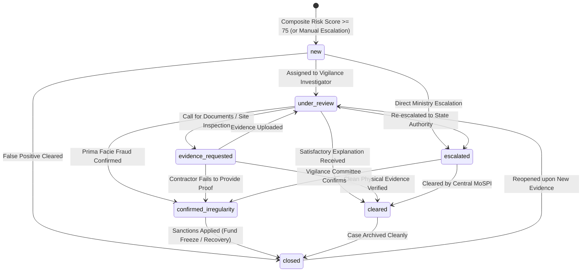

# MPLADS Sentinel: Comprehensive System Architecture, Operational Mechanics & Technical Flow

> **Statutory Jurisdiction**: Ministry of Statistics and Programme Implementation (MoSPI) — Data Informatics & Innovation Division (DIID)  
> **Problem Statement**: SIH26102 — Development of an AI-Powered Multi-Source Surveillance, Risk-Intelligence, and Vigilance Governance Layer for the MPLAD Scheme  
> **Document Purpose**: Exhaustive technical documentation explaining how every component, algorithm, database, and user interface works across the entire MPLADS Sentinel platform, accompanied by step-by-step operational workflows.

---

## 1. Executive Overview & Operating Philosophy

### 1.1. What is MPLADS Sentinel?
The **Member of Parliament Local Area Development Scheme (MPLADS)** allocates ₹5 Crore annually per Hon'ble Member of Parliament to recommend developmental works addressing durable community needs (drinking water, primary education, public health, sanitation, and roads).

While the government's official **e-SAKSHI** portal serves as the administrative transaction and workflow recording system, it does not autonomously detect cross-dataset anomalies, evaluate physical-financial divergence, verify contractor collusion, or cross-match site photographs across constituencies.

**MPLADS Sentinel** is an autonomous, AI-powered multi-source surveillance, risk-intelligence, and vigilance governance layer built to operate atop e-SAKSHI. It ingests statutory data, extracts multi-modal signals, computes calibrated composite risk scores, and routes high-risk cases into an audit-defensible investigation pipeline.

```text
┌────────────────────────────────────────────────────────────────────────────────────────┐
│                                 CORE OPERATING PRINCIPLE                               │
│                                                                                        │
│   e-SAKSHI records what happened.                                                      │
│   MPLADS Sentinel verifies whether what happened makes sense, connects evidence across │
│   datasets, explains why a case is risky, and prioritizes investigation queues.        │
└────────────────────────────────────────────────────────────────────────────────────────┘
```

### 1.2. The Four Vigilance Questions
Sentinel systematically answers four fundamental questions for every project:
1. **What is unusual?** $\longrightarrow$ Machine-checked anomaly and pattern detection across financial, physical, spatial, and contractor dimensions.
2. **Why is it unusual?** $\longrightarrow$ Transparent, evidence-backed explanations citing official MoSPI 2023 Guidelines and General Financial Rules (GFR 2017).
3. **How serious is it?** $\longrightarrow$ Calibrated Composite Risk Score ($0$ to $100$) governed by a strict multi-signal confirmation rule.
4. **What should be audited first?** $\longrightarrow$ Risk-ranked prioritization queue ensuring vigilance officers inspect the most critical irregularities immediately.

### 1.3. Three-Tier Governance Control Model
```text
  PREVENTION (Tier 1)         DETECTION (Tier 2)          INVESTIGATION (Tier 3)
  ├── 7-Role Institutional    ├── 21-Module AI Grid       ├── Prioritized Case Queues
  │   RBAC Controls           ├── Multi-Stream Cross-Joins├── Explainable AI Dossiers
  ├── Budget Ceiling Locks    ├── Vision Forensics (dHash)├── Automated Inspection Orders
  ├── Sanction Pre-Checking   ├── Graph Network Clustering└── Statutory Milestone Fund
  └── Milestone Dependencies  └── Composite Risk Fusion        Freezes & Sanctions
```

### 1.4. Zero-Fake-Data Policy & Scoped Surveillance
To ensure audit credibility and compliance during vigilance committee hearings, Sentinel operates under a strict **Zero-Fake-Data Policy**:
- **Unloaded Clean Baseline (`mode: "unloaded"`)**: Before any dataset is ingested or uploaded, the entire system rests at an authentic mathematical zero baseline ($0$ works monitored, $₹0\text{ Cr}$ sanctioned, $₹0\text{ Cr}$ disbursed, $0$ risk flags). All synthetic placeholders and mock data have been eliminated.
- **Dynamic Ingested State (`mode: "uploaded"`)**: Once statutory CSVs are ingested or user documents are uploaded, all metrics, charts, risk tiers, state rankings, and map points are computed live from the processed data.
- **Scope Reversibility**: System Administrators can revert the platform to baseline or switch active evaluation batches at any time via `POST /api/datasets/scope/restore`.

---

## 2. System Architecture & Technological Foundation

MPLADS Sentinel is organized into a cohesive 6-layer architecture spanning frontend command centers, an Express REST API backend, a 21-module Python AI microservice, durable local persistence, and Supabase cloud infrastructure.



### 2.1. Technology Stack Breakdown
| Component | Technologies | Primary Roles |
|---|---|---|
| **Frontend** | Next.js 16 (App Router), React 19 (Pure JSX), Tailwind CSS v4, Lucide React, Recharts | National Command Center, Geospatial Risk Map, Reports Hub, Project Twins, Role Portals, Telemetry Card |
| **API Backend** | Node.js, Express 5.x, Multer (Memory Streaming), Crypto, Morgan, Winston | 7-Role RBAC Middleware, File Streaming, Batch Ingestion, Case State Machine, System Activity Telemetry |
| **AI Microservices** | Python 3.14, FastAPI, Pydantic, Uvicorn | 21 AI modules, sub-second vector inference, tabular anomaly detection, graph clustering |
| **NLP & Vectors** | `sentence-transformers` (`all-MiniLM-L6-v2`), PyTorch | 384-dimensional dense semantic embeddings, cross-lingual duplicate work detection, statutory RAG |
| **Tabular ML** | `scikit-learn` (IsolationForest 100 Trees, Local Outlier Factor) | Multi-dimensional spending velocity outlier detection, CPWD schedule rate deviations |
| **Vision Forensics** | 64-bit Perceptual Difference Hashing (`dHash`), OpenAI `CLIP` (ViT-B/32) | Image deduplication across constituencies (Hamming $\le 6$), zero-shot asset category verification |
| **Document Forensics** | Error Level Analysis (ELA), PaddleOCR | Spliced receipt detection, compression artifact spikes, OCR invoice extraction |
| **Graph Intelligence** | `NetworkX` (Louvain Modularity Community Detection, HHI) | Contractor cartel discovery, bid-rigging rings, monopoly concentration indexing |
| **AI Copilot** | Google Gemini 2.0 Flash + Statutory Vector RAG | Conversational statutory audit query engine grounded in MoSPI Guidelines & GFR 2017 |
| **Persistent Storage** | Atomic JSON Store (`reports_db.json`) + Supabase PostgreSQL | Durable local persistence for audit batches, cloud database backup, Row Level Security (RLS) |
| **Geospatial GIS** | WGS84 Geodetic Normalization Engine + Custom Vector Raster (`/maps/india-states.png`) | Pan-India risk anomaly pinning, calibrated geographic projection, state/UT drill-down |

### 2.2. Directory & Repository Map
```text
MPLADS-Sentinel/
├── backend/                             # Express REST API Server
│   ├── config/                          # Supabase & environment configs
│   ├── controllers/                     # Route controllers (auth, dataset, project, investigation)
│   ├── data/
│   │   ├── official_datasets/           # 12 Official MoSPI CSV Datasets (LS & RS)
│   │   └── reports_db.json              # Durable local persistent reports database
│   ├── middleware/                      # Auth guards & 7-role RBAC security middleware
│   ├── routes/                          # Express API route endpoints
│   ├── services/
│   │   ├── dynamicIngestionService.js   # Multi-slot ingestion & AI orchestration
│   │   ├── reportsDatabaseService.js    # Persistent reports DB manager
│   │   └── supabaseService.js           # Supabase PostgreSQL & Storage client
│   ├── utils/                           # CSV parsing & column normalizer
│   └── server.js                        # Express server entrypoint (:5000)
├── frontend/                            # Next.js 16 App Router UI
│   ├── public/
│   │   └── maps/india-states.png        # Official 624x468 Survey of India base raster
│   └── src/app/
│       ├── app/                         # Authenticated application shell (pure multipage layout)
│       │   ├── admin/                   # Dedicated System Administration Portal
│       │   ├── analytics/               # Geospatial National Risk Map & State Charts
│       │   ├── command-center/          # Primary Surveillance Command Center & Dashboard
│       │   ├── copilot/                 # Grounded MoSPI Audit Copilot
│       │   ├── data/                    # Ingestion Hub & Batch Processing (Add All 12 Files)
│       │   ├── evidence/                # Tamper-Evident Evidence Vault
│       │   ├── investigations/          # Priority Vigilance Case Management
│       │   ├── projects/                # Master Canonical Projects Directory
│       │   │   └── [...projectId]/      # Digital Project Twins (catch-all route for slash-delimited IDs)
│       │   ├── reports/                 # Reports Hub, Persistent DB Browser & Statutory A4 Dossier
│       │   └── risk/                    # Risk Screening & Anomaly Filtering Suite
│       ├── layout.jsx                   # Root layout with Tailwind CSS v4 & theme
│       └── page.jsx                     # Server-side redirect (/) to /app/command-center
├── ai-engine/                           # Python FastAPI AI Surveillance Microservice
│   ├── modules/                         # 21 AI surveillance modules (mod01 to mod21)
│   ├── api.py                           # FastAPI application endpoints (:8000)
│   └── config.py                        # Model weights, thresholds & RAG vector paths
├── scripts/
│   └── test_e2e_integration.js          # Comprehensive E2E test verification suite
├── working.md                           # Master system working & flow documentation (this file)
├── SYSTEM_ARCHITECTURE_AND_DETECTION_FLOW.md # Architectural specification
├── MANUAL_ACTIONS_REQUIRED.md           # External dashboard setup checklist
└── TODO.md                              # Implementation roadmap & status
```

---

## 3. Detailed Operational Flow & System Lifecycle

Every piece of data that enters MPLADS Sentinel progresses through an 8-stage operational pipeline:



### Stage-by-Stage Breakdown

#### Stage 1: Ingestion & Tamper-Evident Fingerprinting
Incoming files (CSVs, PDFs, or photos) are parsed as binary streams using `multer.memoryStorage()`. Before writing to memory or disk, an in-memory SHA-256 hash is computed via `crypto.createHash('sha256')`. This hash acts as an immutable cryptographic audit fingerprint ensuring evidence cannot be repudiated.

#### Stage 2: Schema Normalization & Column Mapping
Different districts and parliamentary divisions use varying column headers for the same statutory concept (e.g., `Work_Title`, `work_desc`, `PROJ_NAME`, `Sanctioned_Cost_INR`, `amt_in_lakhs`). The [`columnNormalizer.js`](file:///d:/Clg/SIH%2726/MPLADS-Sentinel/backend/utils/columnNormalizer.js) scans each column, matches synonyms against a known dictionary, and transforms rows into uniform standardized fields.

#### Stage 3: Canonical Entity Resolution
Since historical records often lack a unified primary key across departments, Module 02 executes hierarchical matching:
1. **Primary Key Match**: Work ID, Voucher Number, or PFMS Reference.
2. **Secondary Heuristic Match**: MP Name + District + Sanction Amount + Date Window ($\pm 15\text{ days}$).
3. **Semantic Match**: Sentence-Transformer embeddings comparing project descriptions ($> 88\%\text{ cosine similarity}$).
Contractor names (e.g., `CPWD Div-IV`, `Exec Eng CPWD 4`, `C.P.W.D. Division 4`) are clustered using Levenshtein distance into a single canonical agency identity.

#### Stage 4: 21-Module AI Anomaly Screening
The assembled `CanonicalWorkProfile` is submitted to the AI detection grid. All 21 modules evaluate specific fraud vectors in parallel:
- Semantic scope duplication (Module 09).
- Physical-financial divergence (Module 08).
- Cost rate anomalies (Module 05).
- Split invoicing and installment structuring (Module 07).
- Image reuse across constituencies (Module 13).
- Spatial geofence boundaries (Module 14).

#### Stage 5: Multi-Signal Risk Fusion
Module 17 aggregates all triggered anomaly signals using a weighted mathematical formula. If a work is flagged as an unrated duplicate, it receives the `Duplicate` band (`score: null`). Otherwise, it receives a composite numerical score ($0-100$). A double-confirmation rule ensures no project is classified as Critical without at least two independent anomaly signals.

#### Stage 6: Persistent Reports Database Storage
The evaluation results are committed to [`reports_db.json`](file:///d:/Clg/SIH%2726/MPLADS-Sentinel/backend/data/reports_db.json) via [`reportsDatabaseService.js`](file:///d:/Clg/SIH%2726/MPLADS-Sentinel/backend/services/reportsDatabaseService.js) and synced to Supabase PostgreSQL. The active surveillance scope transitions from `unloaded` to `uploaded`.

#### Stage 7: Zero-Latency UI Re-rendering
The Next.js frontend catches the update, updating all navigation routes:
- `/app/command-center`: Renders real-time risk distribution, velocity charts, and priority queues.
- `/app/analytics`: Renders calibrated WGS84 pins across the national risk map.
- `/app/reports`: Generates the official statutory A4 dossier and itemized ledger.

#### Stage 8: Investigation Escalation & Warrants
Critical works (Risk Score $\ge 80$) are automatically routed to the investigation queue. When an investigator marks a case as `evidence_requested`, an automated Field Inspection Warrant is dispatched. If confirmed irregular, milestone fund releases are frozen.

---

## 4. Ingestion, Hashing & Schema Normalization Layer

### 4.1. The 12 Official Parliamentary Datasets
Sentinel natively ingests and joins all 12 official government CSV datasets published by MoSPI across both Houses of Parliament:

| Slot Key | Stage / Dataset Label | Lok Sabha Dataset | Rajya Sabha Dataset | Critical For AI Modules |
|---|---|---|---|---|
| `recommended` | **Works Recommended** | `Works Recommended (Lok Sabha).csv` | `Works Recommended (Rajya Sabha).csv` | Mod 03 (Proposal Benchmarks), Mod 09 (Duplicate Scope NLP) |
| `sanctioned` | **Works Sanctioned** | `Works Sanctioned (Lok Sabha).csv` | `Works Sanctioned (Rajya Sabha).csv` | Mod 02 (Central Registry), Mod 05 (Cost Outliers), Mod 06 (Timeline Forecaster) |
| `completed` | **Works Completed** | `Works Completed (Lok Sabha).csv` | `Works Completed (Rajya Sabha).csv` | Mod 08 (Physical Sign-off), Lifecycle Verification |
| `expenditure` | **Expenditures & Disbursements** | `Expenditure on Completed and On-going Works as on Date (Lok Sabha).csv` | `Expenditure on Completed and On-going Works as on Date (Rajya Sabha).csv` | Mod 07 (Split Payments), Mod 08 (Physical-Financial Gap), Mod 10/15 (Vendor Cartels) |
| `limits` | **Allocated Limits for MPs** | `Allocated Limit for Honble MPs (Lok Sabha).csv` | `Allocated Limit for Honble MPs (Rajya Sabha).csv` | Mod 04 (MP Annual Quota Statutory Ceiling §3.1) |
| `calamity` | **Calamity Consents** | `Amount consented for Calamity (Lok Sabha).csv` | `Amount consented for Calamity (Rajya Sabha).csv` | Mod 04 (Disaster Relief Allocations §5.2) |

### 4.2. In-Memory Streaming & SHA-256 Proof of Integrity
To prevent disk I/O bottlenecks and protect against file manipulation:
1. Files are uploaded via multipart form data parsed by `multer({ storage: multer.memoryStorage(), limits: { fileSize: 50 * 1024 * 1024 } })`.
2. As the buffer streams into memory, `crypto.createHash('sha256').update(buffer).digest('hex')` calculates a cryptographic hash.
3. This hash is permanently recorded alongside the batch ID in `reports_db.json` and in Supabase Storage metadata.

### 4.3. Schema Normalization & Dynamic Completeness Scoring
Because column headers vary widely across administrative departments, the normalizer maps synonyms:
- `work_id` $\longleftarrow$ `["Work ID", "work_id", "Project ID", "PROJ_CODE", "Work Code"]`
- `title` $\longleftarrow$ `["Work Description", "work_title", "PROJ_NAME", "Description", "Work Name"]`
- `sanction_amount` $\longleftarrow$ `["Sanction Amount", "sanctioned_cost", "Amount Sanctioned", "Cost (INR)"]`
- `disbursed_amount` $\longleftarrow$ `["Total Expenditure", "disbursed_amt", "Amount Released", "Expenditure INR"]`

#### Completeness Score Formulation
$$\text{Data Completeness Score} = \left( \frac{\sum_{j=1}^{6} \mathbb{I}(\text{Slot } j \text{ Uploaded})}{6} \right) \times 100\%$$

#### Graceful AI Degradation
If specific streams are omitted during an upload, Sentinel does not crash; instead, it gracefully degrades specific modules:
- Missing `expenditure` $\implies$ Module 08 (Physical-Financial Divergence) and Module 15 (Cartels) are deferred without falsely penalizing the project score.
- Missing `recommended` $\implies$ Module 09 (Duplicate Scope) falls back to single-file intra-dataset heuristics.
- Missing `limits` $\implies$ Quota overrun checks are marked as `Unverified - Insufficient Data`.

### 4.4. System Administrator 1-Click Multi-Stream Batch Ingestion
Under `POST /api/datasets/admin/ingest-all`:
1. The server reads all 12 official CSVs from `backend/data/official_datasets/`.
2. All rows are parsed concurrently, joined across Lok Sabha and Rajya Sabha, and linked to unified `CanonicalWorkProfile` instances.
3. The 21-module AI grid executes across all records.
4. The synthesized batch is committed to `reports_db.json` and Supabase.
5. The surveillance scope is switched to `uploaded`, instantly populating the entire system.

---

## 5. Canonical Entity Resolution Engine (Module 02)

### 5.1. Why Entity Resolution is Critical
In government schemes, multiple departments maintain separate ledgers:
- Planning Department logs recommendations.
- District Collectorate logs administrative sanctions.
- Implementing Agency logs Running Account (RA) bills.
- Treasury logs PFMS vouchers.

These records frequently suffer from spelling variations, differing ID schemes, and typographical errors. Without entity resolution, projects cannot be cross-referenced, making cross-dataset fraud invisible.

### 5.2. Three-Tier Hierarchical Matching Pipeline


### 5.3. Contractor & Implementing Agency Alias Clustering
Contractor names often appear with slight variations (e.g., `M/S Krishna Construction`, `KRISHNA CONSTR CO`, `Krishna Builders & Assoc`). Sentinel applies normalized **Levenshtein Distance** and **Jaro-Winkler Similarity**:
$$\text{Sim}_{\text{JW}}(s_1, s_2) \ge 0.88 \implies \text{Merge into single Contractor UID}$$
This prevents contractors from evading monopoly concentration detection (Module 10) by fragmenting their business names.

---

## 6. The 21-Module Multi-Vector AI Surveillance Grid

The core intelligence of Sentinel resides in its 21 specialized AI detection modules organized across 7 analytical domains:

### 6.1. Master 21-Module Specification Matrix

| # | Module Name | Primary Inputs | Core Technique / Algorithm | Anomaly Condition | Statutory Citation |
|---|---|---|---|---|---|
| **01** | Data Quality AI | Raw CSV / Upload Streams | Pydantic validation, schema hashes | Missing critical columns, malformed data | MoSPI Data Standard 2023 |
| **02** | Entity Resolution AI | Work IDs, Descriptions, Dates | Levenshtein + SBERT Embedding Joins | Mismatched department records | Public Records Act 1993 |
| **03** | Proposal Intelligence | Work Description, Estimates | `all-MiniLM-L6-v2` + Robust Median | Inflated estimate vs district median | MPLADS Guidelines §2.3 |
| **04** | Statutory Compliance AI | Category, Quotas, Dates | Deterministic Rule Matrix + Regex | Non-permissible work, quota breach | MPLADS Guidelines §3.1, §5.2 |
| **05** | Cost Anomaly AI | Sanction, Disbursed, Unit Rates | Isolation Forest (100 Trees) + Z-Scores | Unit cost $> 28\%$ above state CPWD | GFR 2017 Rule 130 |
| **06** | Timeline Forecaster | Recom, Sanction, Comp Dates | State Machine + Historical SLAs | Sanction SLA $> 45\text{d}$, Stalled $> 365\text{d}$ | MPLADS Guidelines §3.2 |
| **07** | Financial Anomaly AI | Vouchers, Installment Counts | IQR Spikes, Benford's Law, Clustering | Multi-installment split structuring | GFR 2017 Rule 157 |
| **08** | Physical-Financial Gap | Disbursed INR vs Physical % | Divergence arithmetic ($\delta > 0.25$) | Disbursed $\ge 80\%$ while physical $\le 55\%$ | MPLADS Guidelines §3.4 |
| **09** | Duplicate Work NLP | Work Titles, Geocodes | SBERT cross-lingual cosine similarity | Title similarity $> 88\%$ within $< 450\text{m}$ | MPLADS Guidelines §2.4 |
| **10** | Vendor Intelligence | Vendor Names, Paid Amounts | Levenshtein Clustering + HHI Index | Shell vendor fragmentation, HHI $> 2500$ | CVC Guidelines §4.2 |
| **11** | Document OCR AI | PDF Sanction Orders, Bills | PaddleOCR + Bounding Box Layout | Bill amounts exceed approved sanction | GFR 2017 Rule 134 |
| **12** | Document Forensics | Scanned Invoices, Receipts | Error Level Analysis (JPEG Artifacts) | Digitally altered / spliced invoice | IPC §468 (Forgery) |
| **13** | Visual Verification AI | Site Inspection Photographs | 64-bit `dHash` + OpenAI `CLIP` Zero-Shot | Hamming $\le 6$ (Image reused across works) | Annexure III (Photo Norms) |
| **14** | Geospatial Intelligence | GPS Coordinates, Boundaries | Haversine Distance + Point-in-Polygon | Coordinates $> 250\text{m}$ outside boundary | WGS84 Geodetic Norms |
| **15** | Graph Intelligence | MP-Agency-Vendor Relations | NetworkX Louvain Modularity Clustering | Bid-rigging rings, IDA self-dealing | Competition Act §3 |
| **16** | Predictive Risk AI | Historical Milestone Rates | Ridge Regression / Survival Analysis | High probability ($> 80\%$) chronic delay | PMO Monitoring Directives |
| **17** | Risk Fusion Engine | All Module Sub-Scores ($S_i$) | Multi-Signal Weighted Aggregation | Composite score $\ge 60$ or unrated duplicate | Master Vigilance Protocol |
| **18** | Explanation Engine | Triggered Signals, Rows | Feature Attribution Trees + Citations | Generates plain-language audit justification | Administrative Law Norms |
| **19** | Statutory Dossier Gen. | Work Twin, Evidence Chain | PDFKit / HTML A4 Official Template | Compiles legal investigation brief | MoSPI Vigilance Manual |
| **20** | MoSPI Audit Copilot | Auditor Natural Language Query| Statutory Vector RAG + Gemini 2.0 Flash | Answers grounded in 2023 Guidelines | MoSPI Digital Governance |
| **21** | Active Learning Loop | Auditor Dispositions & Verdicts | Bayesian Weight Recalibration | Adapts module weights based on audit outcomes| SIH26102 Continuous Learning|

### 6.2. In-Depth Operational Breakdown of Key Modules

#### Module 08: Physical-Financial Progress Divergence AI
One of the most frequent indicators of fund diversion is when funds are rapidly drawn down from treasury before physical construction commences.
- **Formula**:
  $$\delta = \left( \frac{\text{Cumulative Disbursed}}{\text{Sanctioned Budget}} \right) - \left( \frac{\text{Verified Physical Progress \%}}{100} \right)$$
- **Trigger**: If $\delta \ge +0.25$ (e.g., $88\%$ funds released but only $52\%$ physical progress verified), the module emits a `HIGH` or `CRITICAL` anomaly with sub-score $S_8 = \min(100, \; \delta \times 160)$.

#### Module 09: Duplicate & Split Work Detection AI
Prevents MPs or implementing agencies from recommending the same asset twice or splitting a large project into smaller fragments to bypass mandatory e-tendering:
- **Semantic Similarity**: Encodes project titles using `all-MiniLM-L6-v2` into 384-dimensional dense vectors. Cosine similarity is computed between all works in the same district:
  $$\text{Sim}_{\text{cos}}(u, v) = \frac{u \cdot v}{\|u\|_2 \|v\|_2}$$
- **Spatial Proximity**: Computes Haversine distance between geocoded coordinates.
- **Rule**: If $\text{Sim}_{\text{cos}} \ge 0.88$ and Distance $\le 450\text{ meters}$, the work is flagged as a Duplicate. Under Sentinel rules, duplicate works are marked as **Unrated (`score: null`)** and tagged with the purple `Duplicate` badge.

#### Module 13: Visual Verification AI (Image Reuse & Category Verification)
Contractors occasionally submit photographs of previously completed assets to claim milestone payments for incomplete projects.
- **Perceptual Difference Hashing (`dHash`)**: Resizes inspection photos to $9 \times 8$ grayscale, computes adjacent pixel gradients, and produces a 64-bit binary fingerprint. If Hamming distance $\le 6$ bits between two distinct Work IDs, the image is identified as reused.
- **Zero-Shot Category Verification (`CLIP ViT-B/32`)**: Compares the photograph against prompt text embeddings (e.g., *"a photo of a primary school mid-day meal shed"* vs *"a photo of a dirt road"*). If similarity is below $0.20$, an asset mismatch alert is issued.

#### Module 15: Graph Relationship & Cartel Clustering
Constructs a tri-partite network graph:
$$G = (V, E), \quad V = \{ \text{MPs} \} \cup \{ \text{Implementing Agencies} \} \cup \{ \text{Contractors} \}$$
- **Cartel Detection**: Applies the Louvain community detection algorithm to identify dense clusters where specific contractors exclusively win contracts from specific agencies without competitive bidding.
- **Monopoly Index**: Computes the Herfindahl-Hirschman Index (HHI) for each district:
  $$\text{HHI} = \sum_{k=1}^{N} s_k^2 \quad (\text{where } s_k \text{ is contractor } k\text{'s market share percentage})$$
  $\text{HHI} > 2500$ indicates extreme monopoly concentration.

---

## 7. Mathematical Multi-Signal Risk Fusion Engine

To ensure that vigilance officers are not overwhelmed with false alarms, Sentinel enforces a **Multi-Signal Double-Confirmation Principle**: a single minor warning cannot elevate a project to Critical Risk; it requires at least two independent confirmatory risk signals.



### 7.1. The Composite Risk Score Formula
$$\text{Composite Risk Score} = \min\left(100, \; \sum_{i=1}^{8} \left( S_i \times W_i \times C_i \right) + \Delta_{\text{multiplier}}\right)$$

Where:
- $S_i \in [0, 100]$: Normalized risk sub-score generated by analytical domain $i$.
- $W_i \in [0, 1]$: Pre-calibrated statutory domain weight ($\sum W_i = 1.0$).
- $C_i \in [0.5, 1.0]$: Data completeness confidence index (degrades when streams are missing).
- $\Delta_{\text{multiplier}} = +15$: Confirmatory boost injected when $\ge 2$ independent signals exceed the severe anomaly threshold ($S_i \ge 80$).

### 7.2. Risk Weighting Matrix
| Index ($i$) | Analytical Risk Dimension | Weight ($W_i$) | Primary Mapped AI Modules | Key Anomaly Triggers |
|---|---|---|---|---|
| **1** | Financial & Split Invoicing | $0.25$ | Mod 07, Mod 08 | Installment frequency spikes, overpayments, round-tripping |
| **2** | Physical-Financial Divergence | $0.20$ | Mod 08, Mod 16 | Financial drawdown $\gg$ verified on-ground physical progress |
| **3** | Visual Evidence Integrity | $0.15$ | Mod 13, Mod 14 | Missing photos, reused pHash fingerprints, geofence breaches |
| **4** | Duplicate & Ghost Assets | $0.15$ | Mod 03, Mod 09 | High semantic title overlap within spatial radius |
| **5** | Vendor & Cartel Concentration | $0.10$ | Mod 10, Mod 15 | Fuzzy shell fragmentation, IDA self-dealing, high HHI |
| **6** | Statutory & Policy Compliance | $0.05$ | Mod 04 | Prohibited categories, outside-constituency caps, SC/ST deficit |
| **7** | Timeline & SLA Slippage | $0.05$ | Mod 06, Mod 16 | 45-day sanction SLA breach, 1-year stalled project state |
| **8** | Document Forensics | $0.05$ | Mod 11, Mod 12 | Altered sanction metadata, OCR text mismatches, ELA artifacts |

### 7.3. Quantitative Ground Truth & Tier Classification
1. **Unrated Duplicate Rule**: Duplicate projects are strictly excluded from numerical averages. They carry `score: null` and display the purple `Duplicate` badge with the `CopyCheck` icon.
2. **Quantitative Ground Truth for Rated Works**: The numerical score dictates the risk tier, color, and icon across all interfaces:
   - **80 – 100** $\longrightarrow$ `Critical` (Rose / Red, `ShieldAlert` icon)
   - **60 – 79** $\longrightarrow$ `High` (Orange, `AlertTriangle` icon)
   - **35 – 59** $\longrightarrow$ `Medium` (Amber / Yellow, `Clock` icon)
   - **0 – 34** $\longrightarrow$ `Low` (Emerald / Green, `CheckCircle` icon)

---

## 8. Persistent Reports Database & Surveillance Scoping Architecture

### 8.1. How `reportsDatabaseService.js` Operates
All processed audit batches, itemized ledgers, and active surveillance scopes are persisted through [`backend/services/reportsDatabaseService.js`](file:///d:/Clg/SIH%2726/MPLADS-Sentinel/backend/services/reportsDatabaseService.js):
- **Storage Location**: [`backend/data/reports_db.json`](file:///d:/Clg/SIH%2726/MPLADS-Sentinel/backend/data/reports_db.json).
- **In-Memory Cache & Atomic Disk Writes**: Reads the JSON file into memory on startup. Subsequent writes use `fs.writeFileSync()` wrapped in try-catch to prevent corruption during server crashes.
- **50-Batch Rolling Catalog**: Automatically rotates batches, retaining the 50 most recent evaluations to prevent uncontrolled disk growth.

### 8.2. Surveillance Scoping State Machine


### 8.3. The Reports Hub (`/app/reports`)
The Reports Hub provides two complementary views:
1. **Official Statutory HTML Dossier Viewer**:
   - Renders a pixel-perfect, government-standard **A4 statutory audit brief**.
   - Includes government insignia, MoSPI reference headers, SHA-256 integrity stamp, executive summary, radar metrics, and itemized AI violation findings.
   - Built-in toolbar with Zoom In ($+$), Zoom Out ($-$), Zoom Reset ($100\%$), and 1-Click Print / PDF Export (`window.print()`) with print CSS media queries.
2. **Interactive Itemized Works Ledger**:
   - Tabular view of all works in the batch with real-time text search, risk tier dropdown filters, and duplicate toggles.
   - 1-click CSV export of the active audit ledger.

---

## 9. National Geospatial Project Risk Map & Geodetic Projection Engine

### 9.1. Cartographic Base
Located at `/app/analytics` (and `/app/command-center`), the risk map provides an interactive geographic representation of project anomalies across India. It relies on a clean, vector-rendered raster map:
- **Image File**: [`frontend/public/maps/india-states.png`](file:///d:/Clg/SIH%2726/MPLADS-Sentinel/frontend/public/maps/india-states.png).
- **Native Dimensions**: $624 \times 468\text{ pixels}$ ($4:3\text{ aspect ratio}$).
- **Cartographic Boundaries**: Aligned with the official Survey of India political boundaries.

### 9.2. WGS84 Geodetic Normalization Formulation
To position GPS coordinates $(\text{Lat}, \text{Lon})$ onto the raster without third-party tile servers or external map API keys, Sentinel uses a calibrated geodetic projection formula:

$$\begin{aligned}
x_{\text{px}} &= 116 + \left(\frac{\text{Lon} - 68.11}{97.40 - 68.11}\right) \times (507 - 116) \\
y_{\text{px}} &= 24 + \left(\frac{37.10 - \text{Lat}}{37.10 - 8.08}\right) \times (425 - 24) \\
x_{\text{pct}} &= \left(\frac{x_{\text{px}}}{624}\right) \times 100\% \\
y_{\text{pct}} &= \left(\frac{y_{\text{px}}}{468}\right) \times 100\%
\end{aligned}$$

Where:
- Westernmost calibration anchor: $68.11^\circ\text{E} \implies 116\text{px}$.
- Easternmost calibration anchor: $97.40^\circ\text{E} \implies 507\text{px}$.
- Northernmost calibration anchor: $37.10^\circ\text{N} \implies 24\text{px}$.
- Southernmost calibration anchor: $8.08^\circ\text{N} \implies 425\text{px}$.

### 9.3. Map UX Features
- **Pulsing Radar Pins**: Critical risk points pulse continuously (`animate-ping`), immediately drawing attention to acute irregularities.
- **Hover Micro-Tooltips**: Displays project title, district, state, sanctioned amount, and risk score.
- **Interactive Anomaly Drawer**: Clicking a pin opens a slide-over panel displaying itemized AI signals, statutory citations, and a direct navigation link to the project's digital twin (`/app/projects/:id`).
- **Zero-Data Overlay**: Displays a clean "Geospatial Surveillance Standing By" card when un-ingested.

---

## 10. 7-Role Institutional Governance & Dedicated Admin Portal

Access adheres to the institutional governance principle: `Role + Jurisdiction + Assignment + Permission`.

> [!IMPORTANT]
> **Zero Public Registration**: Self-registration is permanently disabled. Institutional user accounts and role assignments are provisioned exclusively by the **Platform System Administrator**.



### 10.1. Permissions Matrix across Roles

| Functional Permission | MoSPI Central | State Nodal | Hon'ble MP | Impl. Agency | Investigator | Field Officer | System Admin |
|---|:---:|:---:|:---:|:---:|:---:|:---:|:---:|
| User & Role Management | $\times$ | $\times$ | $\times$ | $\times$ | $\times$ | $\times$ | $\checkmark$ |
| View National Analytics | $\checkmark$ | $\times$ | $\times$ | $\times$ | $\checkmark$ | $\times$ | $\checkmark$ |
| View State/District Scope | All-India | Own State | Own PC | Assigned | All Cases | Assigned | All-India |
| Recommend New Works | $\times$ | $\times$ | $\checkmark$ | $\times$ | $\times$ | $\times$ | $\times$ |
| Submit Contractor RA Bills | $\times$ | $\times$ | $\times$ | $\checkmark$ | $\times$ | $\times$ | $\times$ |
| Upload Inspection Photos & GPS | $\times$ | $\times$ | $\times$ | $\times$ | $\times$ | $\checkmark$ | $\times$ |
| Initiate Vigilance Investigation | $\checkmark$ | $\checkmark$ | $\times$ | $\times$ | $\checkmark$ | $\times$ | $\checkmark$ |
| Freeze Project Disbursals | $\checkmark$ | $\checkmark$ | $\times$ | $\times$ | $\checkmark$ | $\times$ | $\times$ |
| Export Statutory Dossier (PDF) | $\checkmark$ | $\checkmark$ | $\checkmark$ | $\times$ | $\checkmark$ | $\times$ | $\checkmark$ |
| Query MoSPI Audit Copilot | $\checkmark$ | $\checkmark$ | $\checkmark$ | $\times$ | $\checkmark$ | $\times$ | $\checkmark$ |
| Inspect System Audit Logs | $\checkmark$ | $\times$ | $\times$ | $\times$ | $\checkmark$ | $\times$ | $\checkmark$ |

### 10.2. Institutional Blind Spots & Anti-Tampering Rules
To prevent conflicts of interest:
- **MPs Cannot View Internal Vigilance Queues**: An MP can track project execution but cannot view confidential vigilance inquiry notes or fraud alerts targeting their own constituency.
- **Implementing Agencies Cannot Modify Sanctions**: Agencies can submit expenditure vouchers but cannot modify sanctioned costs or approve their own milestones.
- **Immutable Audit Trail**: Financial records, evidence hashes, and AI evaluations cannot be overwritten or deleted. Any administrative change generates a new version with a cryptographic SHA-256 audit entry.

### 10.3. The Dedicated Admin Portal (`/app/admin`)
Located at [`frontend/src/app/app/admin/page.jsx`](file:///d:/Clg/SIH%2726/MPLADS-Sentinel/frontend/src/app/app/admin/page.jsx), this dashboard gives System Administrators full operational control:
- **User Provisioning & Role Assignment**: Create new institutional accounts, assign designations, and assign jurisdictional scopes (National, State, District, Constituency).
- **1-Click Batch Ingestion**: Trigger immediate ingestion and AI evaluation of all 12 official MoSPI CSV datasets.
- **Surveillance Scope Reset**: Restore the platform to the clean mathematical baseline.
- **System Audit Logs**: Real-time review of all user logins, role modifications, and status changes.

---

## 11. Investigation Case State Machine & Escalation Lifecycle

When an acute irregularity is identified, Sentinel transitions it through a formal, auditable state machine governed by [`backend/controllers/investigationController.js`](file:///d:/Clg/SIH%2726/MPLADS-Sentinel/backend/controllers/investigationController.js):



### 11.1. Automated Escalation Triggers
1. **Trigger 1: Automated Inspection Warrant on `evidence_requested`**:
   - When a case moves to `evidence_requested`, Sentinel automatically dispatches a **Field Physical Inspection Warrant** to the Field Verification Wing.
   - The warrant includes registered project coordinates, target milestone percentages, and specific inspection instructions.
2. **Trigger 2: Milestone Fund Freeze on `confirmed_irregularity`**:
   - When confirmed irregular, Sentinel executes an automated **Statutory Disbursement Hold**.
   - The project's digital twin is locked against future treasury drawdowns until cleared by MoSPI.
   - The irregularity signature is automatically fed back to Module 21 (Active Learning) to refine future detection thresholds.

---

## 12. Real-Time Operational Telemetry & Health Monitoring

To ensure operational readiness, Sentinel provides live health monitoring via a dedicated telemetry subsystem.

### 12.1. The Heartbeat Telemetry Card (`/api/system/activity`)
A telemetry monitor is embedded in the bottom-left sidebar footer across all dashboard pages:
- **Database Engine**: Indicates connection status (`Connected` / `Online`), total active records, and persistence backend (Supabase PostgreSQL / Persistent JSON Store).
- **Backend Service**: Reports Express server port (`5000`), uptime counter, and API response latency.
- **AI Surveillance Grid**: Confirms operational readiness (`21/21 Ready`), assurance grade (`Statutory Grade`), and inference model health.

### 12.2. Deep Diagnostic Health Check (`/api/health`)
The endpoint `GET /api/health` performs end-to-end verification:
```json
{
  "status": "healthy",
  "timestamp": "2026-09-07T18:15:00.000Z",
  "uptimeSeconds": 1420,
  "nodeEnv": "production",
  "database": {
    "status": "connected",
    "totalProjects": 500,
    "totalInvestigations": 12,
    "activeScope": "uploaded"
  },
  "aiEngine": {
    "status": "ready",
    "modulesAvailable": 21,
    "activeGrid": "statutory_v2"
  },
  "storage": {
    "status": "online",
    "provider": "supabase_cloud"
  }
}
```

---

## 13. Grounded AI Audit Copilot (Module 20)

### 13.1. Architecture
Located at `/app/copilot`, the Audit Copilot provides a natural language query interface for auditors, investigators, and ministry officials. It combines **Google Gemini 2.0 Flash** with a **Statutory Vector Retrieval-Augmented Generation (RAG)** pipeline:

```text
Auditor Query ("Which works in Varanasi have physical-financial divergence > 30%?")
  │
  ├──► Vector Retriever (all-MiniLM-L6-v2)
  │      └── Embeds query and retrieves relevant clauses from MoSPI Guidelines 2023 & GFR 2017
  │
  ├──► Structured SQL Retriever
  │      └── Queries active project twins & expenditure ledgers for empirical matches
  │
  └──► Gemini 2.0 Flash Synthesis
         └── Generates concise auditor brief with direct statutory citations and work IDs
```

### 13.2. Zero-Hallucination Guardrails
To prevent AI hallucinations during official vigilance inquiries:
1. The Copilot is restricted to structured project data and official statutory rulebooks.
2. Every finding cites specific sections (e.g., *“MPLADS Guidelines 2023 §3.4”* or *“GFR 2017 Rule 157”*).
3. If data is missing or ambiguous, the Copilot explicitly states that evidence is insufficient rather than generating estimates.

---

## 14. Step-by-Step User Journey Walkthroughs

### Walkthrough 1: Administrator 1-Click Master Ingestion
1. Administrator logs into `/login` with credentials `admin@mplads-sentinel.gov.in`.
2. System verifies `system_admin` role and redirects to `/app/admin`.
3. Administrator clicks **"Ingest All 12 Official Datasets"**.
4. The backend streams all 12 Lok Sabha and Rajya Sabha CSVs, executes SHA-256 fingerprinting, runs the 21 AI modules, and commits the batch to `reports_db.json`.
5. Administrator navigates to `/app/command-center`: the dashboard is populated with 500+ monitored works, real-time risk distributions, and priority investigation queues.

### Walkthrough 2: MoSPI Central Officer National Risk Triage
1. Central Officer accesses `/app/command-center`.
2. Observes the **National Risk Donut** showing 3 Critical works and the **Anomaly Velocity Chart**.
3. Clicks on the top Critical work in the **Priority Investigation Queue**.
4. Directed to `/app/projects/WS/MP18152/2024`:
   - Inspects the milestone gap bar: **$87\%$ funds released vs $52\%$ physical progress** (Gap: $35\%$).
   - Views AI explanation: *“Physical-Financial Divergence breach under MPLADS Guidelines §3.4”*.
5. Clicks **"Initiate Investigation"**: enters notes and confirms case creation.

### Walkthrough 3: Field Verification Officer Mobile Site Inspection
1. Field Officer opens `/app/evidence` on a tablet or mobile browser.
2. Selects assigned project warrant `CASE-2026-00412` for inspection.
3. Uploads on-site photograph: browser captures EXIF metadata and GPS coordinates.
4. Sentinel executes Module 14 (Geospatial Geofencing) and Module 13 (dHash Visual Check):
   - Confirms coordinates are within $120\text{ meters}$ of registered site (Compliant).
   - Confirms image is novel with no duplicate pHash across other constituencies.
5. Officer confirms physical progress rung at $52\%$; case evidence chain is updated.

### Walkthrough 4: Generating an Official Statutory A4 Dossier
1. Investigator navigates to `/app/reports`.
2. Selects active batch `BATCH-2026-00412`.
3. Opens the **Official Statutory Dossier Viewer**:
   - Inspects executive summary, MoSPI reference numbers, and radar risk breakdown.
   - Clicks **"Print / Export PDF"**: browser opens print dialog with clean A4 styling.
4. Submits printed dossier to the Parliamentary Vigilance Committee.

---

## 15. Developer & Deployment Quickstart Reference

### 15.1. Environment Configuration
Create a `.env` file in `backend/`:
```env
PORT=5000
NODE_ENV=development
SUPABASE_URL=https://your-project.supabase.co
SUPABASE_SERVICE_ROLE_KEY=your-supabase-service-role-key
JWT_SECRET=your-secure-jwt-secret
AI_ENGINE_URL=http://localhost:8000
GEMINI_API_KEY=your-google-gemini-api-key
```

### 15.2. Running Locally
```powershell
# 1. Install root, backend, and frontend dependencies
npm run install:all

# 2. Run backend and frontend concurrently
npm run dev:all

# 3. (Optional) Run Python AI Engine microservice
cd ai-engine
pip install -r requirements.txt
python api.py
```

### 15.3. Automated E2E Test Verification
Execute the automated end-to-end integration test suite to verify backend health, dynamic ingestion, reports database persistence, and investigation state machine transitions:
```powershell
npm run test:e2e
```

---

*Authored for the Ministry of Statistics and Programme Implementation (MoSPI) — Smart India Hackathon (SIH 2026).*
